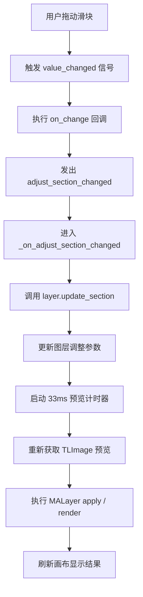
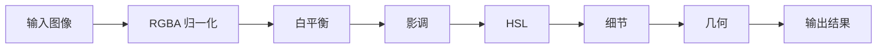
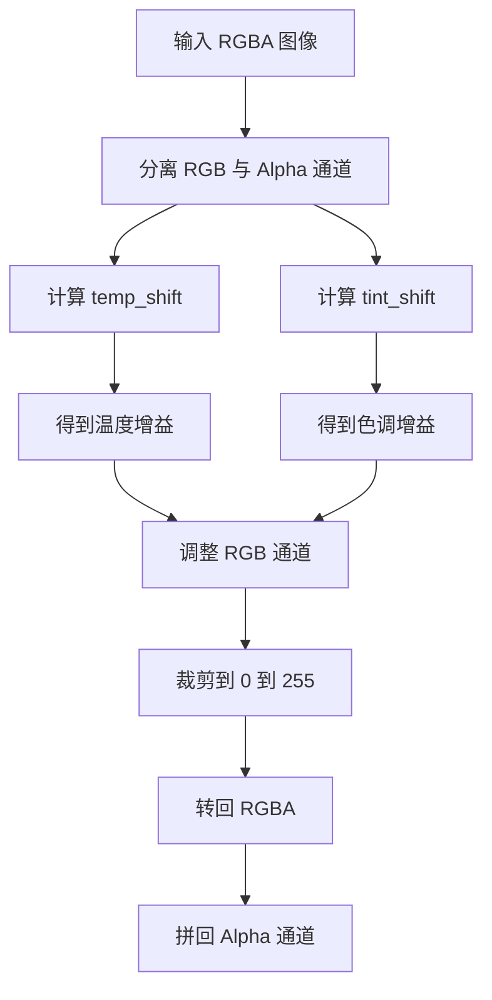

# Adjust Tab 页面操作原理

本文档说明 `Adjust Tab` 从界面滑块交互到图像实际渲染的工作链路，重点讲解 `src/tempusloom/core/malayer.py:461` 开始的白平衡实现，以及它在整个调整管线中的位置。

## 1. 页面在做什么

`Adjust Tab` 本质上是一个“参数驱动的非破坏性调整面板”：

- 左/右滑块负责修改某个调整参数；
- 参数不会直接改写原图，而是写入 `MALayer` 的参数模型；
- 预览层在下一次刷新时重新执行一遍调整管线；
- 最终结果再按图层混合模式、透明度、蒙版与原始图像合成。

对应代码位置：

- 调整面板构建：`src/tempusloom/ui/editor_window.py:2031`
- 白平衡滑块绑定：`src/tempusloom/ui/editor_window.py:2168`
- 通用渐变滑块封装：`src/tempusloom/ui/editor_window.py:2183`
- 调整事件进入图层：`src/tempusloom/ui/editor_window.py:2849`
- 预览节流计时器：`src/tempusloom/ui/editor_window.py:2706`
- 参数归一化与写回：`src/tempusloom/core/malayer.py:432`
- 调整主管线：`src/tempusloom/core/malayer.py:453`

---

## 2. 整体执行链路

## 2.1 从滑块到预览刷新

当用户拖动 Adjust 面板中的滑块时，执行链路如下：



这条链路有两个关键设计点：

- `GradientSlider` 只负责发射数值变化，不直接处理图像；
- 真正的图像计算通过 `QTimer(33ms)` 延迟触发，避免拖动过程中每个像素点变化都立即重算，降低 UI 卡顿风险。

`33ms` 对应大约 `30 FPS` 的预览刷新上限，是“交互流畅”和“CPU 占用”之间的折中。

---

## 3. Adjust Tab 的参数组织方式

在 `MALayer` 中，调整参数按 section 分组管理，例如：

- `basic`
- `white_balance`
- `tone`
- `hsl`
- `detail`
- `geometry`

`update_section()` 会根据 section 名称找到对应参数对象，再把新的值写进去。对应入口见 `src/tempusloom/core/malayer.py:432`。

### 3.1 为什么要做参数归一化

UI 上的滑块值通常是“交互友好值”，例如：

- 色温滑块范围是 `[-100, 100]`
- 色调滑块范围是 `[-100, 100]`

但底层渲染不一定直接使用这个范围，因此在写入参数前要做归一化。

### 3.2 色温映射公式

白平衡里的温度参数，内部不是直接存 `[-100, 100]`，而是映射到接近 Kelvin 的数值区间。

对应实现：`src/tempusloom/core/malayer.py:373`

公式如下：

$$
T_{internal} = \operatorname{clamp}(6500 + 45 \cdot s,\ 2000,\ 50000)
$$

其中：

- $s$ 是 UI 滑块值，范围一般为 `[-100, 100]`
- `0` 表示中性日光 `6500K`
- `-100` 约映射到 `2000K`
- `100` 约映射到 `11000K`

### 3.3 色调映射公式

色调（Tint）内部范围更大，UI 值会先放大到内部校正范围。

对应实现：`src/tempusloom/core/malayer.py:400`

公式如下：

$$
Tint_{internal} = \operatorname{clamp}(1.5 \cdot t,\ -150,\ 150)
$$

其中：

- $t$ 是 UI 色调滑块值
- 负值偏绿
- 正值偏洋红

### 3.4 像素层的实际公式

映射完内部参数后，白平衡是直接对每个像素的 RGB 通道做增益运算。

对应实现：`src/tempusloom/core/malayer.py:517`

$$
\text{temp\_shift} = \frac{T_{internal} - 6500}{6500}
$$

$$
\text{tint\_shift} = \frac{Tint_{internal}}{150}
$$

对应实现：`src/tempusloom/core/malayer.py:519`

$$
R_{out} = \operatorname{clip}\left(R \cdot \left(1 + 0.12 \cdot \text{temp\_shift}\right),\ 0,\ 255\right)
$$

$$
G_{out} = \operatorname{clip}\left(G \cdot \left(1 + 0.08 \cdot \text{tint\_shift}\right),\ 0,\ 255\right)
$$

$$
B_{out} = \operatorname{clip}\left(B \cdot \left(1 - 0.12 \cdot \text{temp\_shift}\right),\ 0,\ 255\right)
$$

$$
A_{out} = A
$$

把 UI 滑块值代入后，可以得到更直接的形式：

当温度滑块为 $s$ 时：

$$
T_{internal} = 6500 + 45s
$$

$$
\text{temp\_shift} = \frac{45s}{6500}
$$

$$
R_{out} = \operatorname{clip}\left(R \cdot \left(1 + 0.12 \cdot \frac{45s}{6500}\right),\ 0,\ 255\right)
$$

$$
B_{out} = \operatorname{clip}\left(B \cdot \left(1 - 0.12 \cdot \frac{45s}{6500}\right),\ 0,\ 255\right)
$$

当色调滑块为 $t$ 时：

$$
Tint_{internal} = 1.5t
$$

$$
\text{tint\_shift} = \frac{1.5t}{150} = \frac{t}{100}
$$

$$
G_{out} = \operatorname{clip}\left(G \cdot \left(1 + 0.08 \cdot \frac{t}{100}\right),\ 0,\ 255\right)
$$

可以直观理解为：

- 温度升高，`R` 增强、`B` 减弱，画面更暖。
- 温度降低，`R` 减弱、`B` 增强，画面更冷。
- 色调在当前实现中是通过修改 `G` 通道增益来近似模拟绿 / 洋红轴。
- 所有通道在输出前都会被 `clip` 到 `[0,255]` 范围。

---

## 4. 调整主管线的顺序

`Adjust Tab` 最终不是只做一个白平衡，而是走完整的参数管线。`apply()` 的调用顺序如下，见 `src/tempusloom/core/malayer.py:453`：

```python
result = _ensure_rgba(image)
result = self._apply_white_balance(result)
result = self._apply_tone(result)
result = self._apply_hsl(result)
result = self._apply_detail(result)
result = self._apply_geometry(result)
return result
```

这意味着页面上的不同 section 虽然看起来彼此独立，但实际渲染是串行叠加的：



顺序的重要性在于：

- 白平衡先改通道平衡，会影响后续亮度与颜色判断；
- 影调再做亮暗区压缩/抬升；
- HSL 在已经校正过的颜色基础上再调色相/饱和度；
- 细节和几何通常放后面，避免前面修改被后续覆盖。

---

## 5. 白平衡算法原理

用户给出的参考区间是 `src/tempusloom/core/malayer.py:461-524`，这一段正是 Adjust Tab 中“白平衡”最核心的实际计算。

### 5.1 设计目标

这套实现不是 Camera Raw 那种物理精确白平衡，而是一个：

- 计算快
- 参数直观
- 拖动反馈稳定
- 适合实时预览

的近似算法。

源码注释中也明确说明：它不是基于相机传感器元数据、色适应矩阵、黑体轨迹拟合的严格模型，而是基于 RGB 通道增益的快速近似。

### 5.2 算法流程



### 5.3 中间变量公式

代码对应：`src/tempusloom/core/malayer.py:517`

#### 温度偏移量

$$
temp\_shift = \frac{T - 6500}{6500}
$$

含义：

- $T = 6500$ 时，`temp_shift = 0`
- $T > 6500$ 时，图像趋向更暖
- $T < 6500$ 时，图像趋向更冷

#### 色调偏移量

$$
tint\_shift = \frac{Tint}{150}
$$

含义：

- 负值向绿色方向偏移
- 正值向洋红方向偏移

### 5.4 RGB 通道增益公式

代码对应：`src/tempusloom/core/malayer.py:519`

对每个像素的三个颜色通道，分别执行：

$$
R' = R \cdot (1 + 0.12 \cdot temp\_shift)
$$

$$
B' = B \cdot (1 - 0.12 \cdot temp\_shift)
$$

$$
G' = G \cdot (1 + 0.08 \cdot tint\_shift)
$$

然后统一裁剪：

$$
(R'', G'', B'') = \operatorname{clip}(R', G', B', 0, 255)
$$

### 5.5 这套公式为什么成立

它依赖的是一种“感知近似”：

- 人眼对“冷暖”的主观感受，主要来自红蓝平衡；
- 人眼对“偏绿/偏洋红”的主观感受，主要落在绿色通道附近；
- 因此用通道乘法增益就能得到一个足够自然、并且很快的实时预览结果。

换句话说，这不是在求真实世界光源色温，而是在做“视觉上像白平衡”的 UI 级校正。

### 5.6 Alpha 为什么单独保留

白平衡只应影响颜色，不应影响透明度，因此算法先转 `RGB` 做运算，最后再通过：

```python
out.putalpha(image.getchannel("A"))
```

把原图 Alpha 通道恢复回来。这样不会破坏透明图层边缘。

### 5.7 白平衡实现的优点与限制

优点：

- 速度快，适合实时拖动预览；
- 算法非常稳定，不容易数值爆炸；
- 行为和 UI 直觉一致：往暖拖就更黄，往冷拖就更蓝。

限制：

- 运算空间是显示 RGB，不是线性光空间；
- 不是物理准确的 Kelvin 转换；
- 极端值下可能发生高光溢出或暗部压缩；
- `0.12` 与 `0.08` 是体验参数，不是摄影科学常数。

---

## 6. 影调（Tone）部分是怎么做的

虽然你给出的重点区间停在白平衡，但在实际页面里，白平衡后面会立刻进入 `Tone` 处理，入口是 `src/tempusloom/core/malayer.py:526`。

## 6.1 基础曝光和对比度

### 曝光

代码：`src/tempusloom/core/malayer.py:529`

曝光使用亮度增强器，增益是指数形式：

$$
Gain_{exposure} = 2^{\operatorname{clamp}(e, -5, 5)}
$$

其中 $e$ 为曝光参数。

这很接近摄影里的“每 +1 EV 亮一倍”的直觉。

### 对比度

代码：`src/tempusloom/core/malayer.py:531`

$$
Gain_{contrast} = \max(0, 1 + \frac{c}{100})
$$

其中 $c$ 是对比度滑块值。

---

## 6.2 高光、阴影、白色、黑色的分区控制

影调处理先把 RGB 归一化到 `[0,1]`，再用平均值近似亮度：

代码：`src/tempusloom/core/malayer.py:534`

$$
L = \frac{R + G + B}{3}
$$

### 高光蒙版

代码：`src/tempusloom/core/malayer.py:536`

$$
M_h = \operatorname{clip}(2(L - 0.5), 0, 1)
$$

然后按比例压暗高亮区域：

$$
RGB' = RGB \cdot \left(1 - M_h \cdot \frac{h}{100} \cdot 0.35\right)
$$

其中 $h$ 是高光滑块值。

### 阴影蒙版

代码：`src/tempusloom/core/malayer.py:539`

$$
M_s = \operatorname{clip}(2(0.5 - L), 0, 1)
$$

阴影提升公式：

$$
RGB' = RGB + (1 - RGB) \cdot M_s \cdot \frac{s}{100} \cdot 0.35
$$

其中 $s$ 是阴影滑块值。

这个写法的好处是：暗部会往亮处抬，但不会轻易超过 1。

### 白色色阶

代码：`src/tempusloom/core/malayer.py:542`

$$
M_w = \operatorname{clip}\left(\frac{L - 0.75}{0.25}, 0, 1\right)
$$

$$
RGB' = RGB + M_w \cdot \frac{w}{100} \cdot 0.2
$$

### 黑色色阶

代码：`src/tempusloom/core/malayer.py:544`

$$
M_b = \operatorname{clip}\left(\frac{0.25 - L}{0.25}, 0, 1\right)
$$

$$
RGB' = RGB - M_b \cdot \frac{b}{100} \cdot 0.2
$$

这样就形成了一个分区亮度控制模型：

- `highlights` 主要影响亮部；
- `shadows` 主要影响暗部；
- `whites` 更偏向最亮端；
- `blacks` 更偏向最暗端。

---

## 7. 页面交互为什么看起来“顺手”

`Adjust Tab` 的体验之所以比较自然，主要来自以下设计：

### 7.1 UI 值与内部值分层

用户拖的是 `[-100, 100]` 这样的易懂范围；底层则保留更适合算法计算的值域。这样既方便交互，也让算法更稳定。

### 7.2 算法选用了近似模型

白平衡、影调都不是最复杂的摄影算法，而是“足够像 + 足够快”的近似方式，更适合桌面编辑器的实时反馈。

### 7.3 管线式串行处理

每个 section 都只负责自己的参数，最终由 `apply()` 按固定顺序串起来，逻辑清晰、可扩展性也更好。

### 7.4 预览刷新做了节流

`33ms` 单次计时器避免了每次鼠标移动都全量重算，能显著改善拖动滑块时的连续感。

---

## 8. 如果后续要继续增强，这里最适合扩展

### 8.1 更真实的白平衡

可以把当前 RGB 通道增益模型，升级为：

- 线性光空间计算；
- 基于色适应矩阵的白平衡；
- 更精确的 Kelvin 到 RGB/XYZ 映射。

但代价是计算量和实现复杂度都会上升。

### 8.2 更准确的亮度估计

当前亮度使用的是：

$$
L = \frac{R + G + B}{3}
$$

如果想更符合视觉感知，可以改成加权亮度，例如：

$$
L = 0.2126R + 0.7152G + 0.0722B
$$

### 8.3 更平滑的区域蒙版

现在高光/阴影/黑白区间采用的是分段线性 `clip` 蒙版；后续可换成 S 曲线或 smoothstep，让过渡更柔和。

---

## 9. 一句话总结

`Adjust Tab` 的核心思想是：**UI 用简单滑块收集参数，`MALayer` 负责把参数归一化并串成图像处理管线，其中白平衡通过 RGB 通道增益近似冷暖与绿洋红偏移，影调再按亮度分区做曝光、高光、阴影、黑白控制，最终得到适合实时预览的非破坏性调整结果。**

