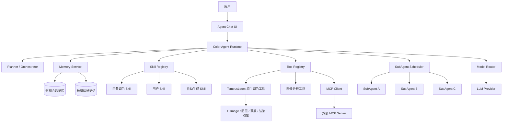
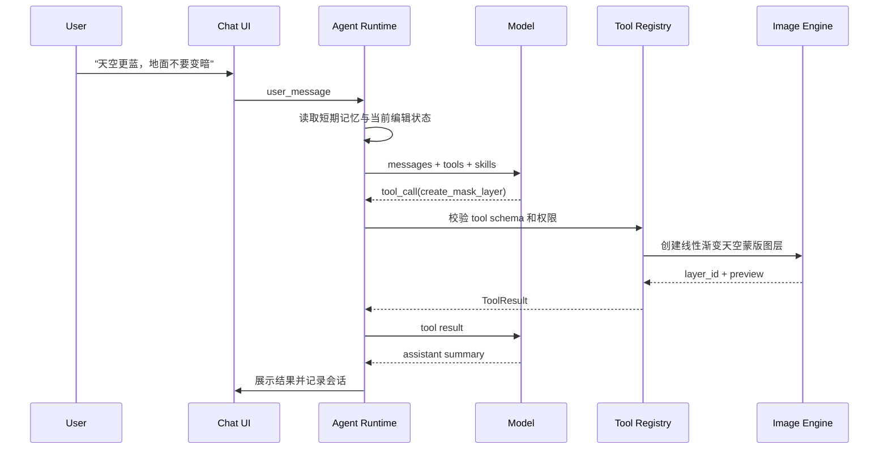
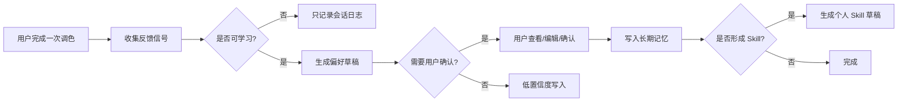
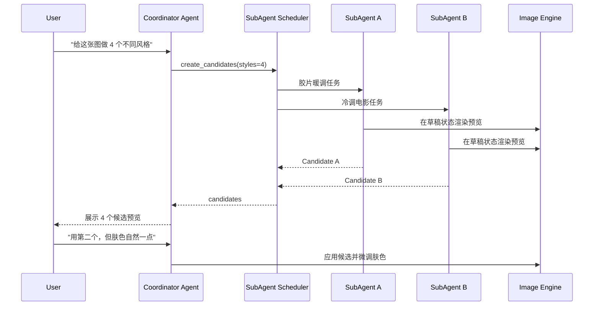
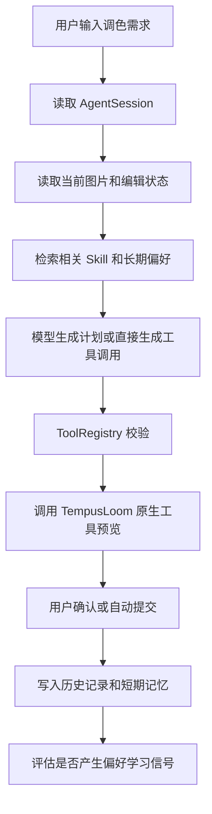
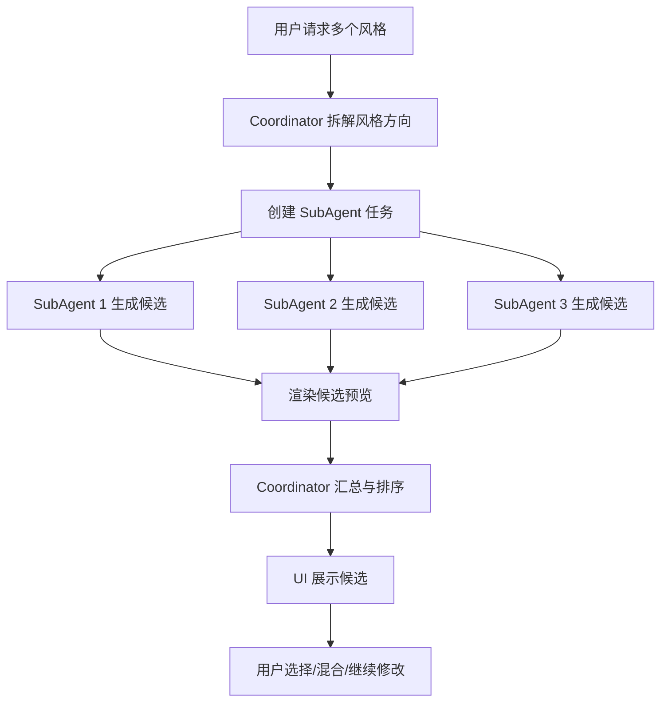

# TempusLoom 调色 Agent 技术方案

**日期**: 2026-05-19  
**状态**: 设计方案  
**适用范围**: 将当前单轮 Agent Chatbox 升级为可对话、可调用工具、可加载 Skill、可接入 MCP、可调度 SubAgent、可学习用户偏好的完整调色 Agent 运行时。

---

## 1. 背景与当前基线

TempusLoom 当前已有第一版 Agent Chatbox：

- UI 底部输入自然语言调色需求。
- `TempusLoomColorAgent.run_single_turn()` 拼接系统提示词、当前图片预览和当前编辑状态。
- 模型返回 TempusLoom 调色 JSON。
- UI 将 JSON 应用到当前 `TLImage`，支持 `adjust`、`mask`、`layers`。

这个版本已经证明了核心闭环：用户描述 -> 模型理解图片 -> 生成调色参数 -> 应用到软件。但它仍是单轮、单模型、单结果的能力，缺少多轮对话、上下文记忆、工具规划、技能复用、外部工具协议和偏好学习。

本方案的目标是在不推翻现有实现的前提下，引入一个独立的 Agent Runtime，将当前 `TempusLoomColorAgent` 演进为运行时中的一个具体任务能力。

---

## 2. 需求细化

### 2.1 对话式调色

用户可以通过连续聊天完成调色，不再要求一次性说清全部需求。Agent 需要理解如下上下文：

- 当前图片、当前预览、当前调色参数、图层顺序、蒙版状态。
- 本轮用户意图，例如“再暖一点”“天空别动”“回到上一步但保留肤色”。
- 前几轮 Agent 做过的操作、模型解释、用户反馈。
- 可用工具、可用 Skill、当前任务约束。

成功标准：

- 支持连续多轮修改同一张图片。
- 用户可要求预览、应用、撤销、比较、保存风格。
- Agent 输出不是只限 JSON，可以在需要时先调用工具、生成多个候选、再让用户选择。

### 2.2 短期记忆与长期记忆

短期记忆是当前对话会话中的状态，生命周期跟随当前图片编辑会话或 Chat Session。

短期记忆包括：

- 消息历史。
- 已加载图片摘要。
- 当前编辑状态快照。
- 最近工具调用记录。
- 临时风格草稿。
- 用户在本会话里的明确偏好，例如“这张图不要太绿”“保留胶片颗粒”。

长期记忆是跨会话持久化的用户偏好、风格资产和学习结果。

长期记忆包括：

- 用户偏好画像，例如常用色温、对比度、肤色保护倾向。
- 已确认的风格 Skill。
- 常用相机、镜头、题材的处理偏好。
- 用户明确收藏、命名、复用的调色方案。
- 负反馈记录，例如“不要这种青橙电影感”。

长期记忆必须有可解释、可编辑、可删除的 UI，避免 Agent 误学或长期保留错误偏好。

### 2.3 Tool 调用

Agent 需要通过工具完成真实调色，而不是只输出文字。工具分三类：

- 软件原生工具：读取当前图片、读取/写入调色参数、创建图层、创建蒙版、渲染预览、撤销重做、保存预设。
- 分析工具：直方图、主色提取、肤色检测、天空/主体区域估计、过曝欠曝检测、色彩倾向分析。
- 外部工具：通过 MCP 或插件接入的第三方模型、批处理脚本、专业图像算法。

每个工具都需要声明：

- 名称、描述、输入 JSON Schema、输出 JSON Schema。
- 是否会修改图片。
- 是否需要用户确认。
- 是否支持 dry-run。
- 权限等级和失败恢复策略。

### 2.4 Skill

Skill 是可复用的调色知识或处理流程，不等同于工具。

Skill 类型：

- Prompt Skill：调色思路、风格拆解、参数建议，例如“日系通透人像”“冷调商业产品图”。
- Procedure Skill：多步处理流程，例如“先压高光，再分离肤色和背景，再微调曲线”。
- Tool Skill：组合多个工具完成特殊处理，例如“天空渐变增强”“肤色保护蒙版”。
- Preference Skill：从长期记忆生成的个人化调色风格，例如“用户 A 的低饱和暖调人像”。

Skill 应该可版本化、可启停、可编辑，并能记录来源：

- 内置。
- 用户手动创建。
- Agent 根据用户反馈自动生成。
- 插件或 MCP Server 提供。

### 2.5 MCP 支持

MCP 支持分为两层：

- TempusLoom 作为 MCP Client：连接外部 MCP Server，使用外部工具、资源、提示词。
- TempusLoom 作为 MCP Server：向外部 Agent 暴露当前图片上下文、调色工具、预览能力。

第一阶段建议优先实现 MCP Client，因为它能直接扩展 Agent 的工具能力。Server 模式可以在运行时稳定后实现，用于让外部 IDE、自动化系统或第三方 Agent 控制 TempusLoom。

### 2.6 SubAgent 多风格生成

用户可能要求“一次给这张图做 5 个不同风格”。此时主 Agent 应扮演协调者：

- 拆解任务：例如胶片、日系、商业干净、冷调电影、复古暖调。
- 创建多个 SubAgent，每个 SubAgent 使用同一张图片和同一初始状态。
- 每个 SubAgent 在隔离草稿中生成调色方案。
- 主 Agent 汇总结果，生成预览缩略图、参数摘要、适用场景说明。
- 用户选择一个应用，也可以要求混合两个方案。

SubAgent 不应直接修改主图；它们只产出候选 Patch 或候选 Layer Stack。

### 2.7 自动学习用户偏好

Agent 需要从用户行为中学习，但必须克制。

可学习信号：

- 用户明确说“以后都按这个风格”。
- 用户收藏某个结果为预设或 Skill。
- 用户多次选择相似候选。
- 用户反复纠正同一类问题，例如“不要过饱和”“肤色别偏红”。
- 用户对生成结果点赞、命名、保存。

不应直接学习的信号：

- 单次撤销。
- 模糊的负反馈。
- 临时任务约束，例如“这张图故意要很蓝”。

学习产物可以是：

- Preference Memory：结构化偏好。
- Generated Skill：可读、可编辑的个人化 Skill。
- Preset：可直接应用的调色参数。

---

## 3. 推荐方案

建议采用“中心 Agent Runtime + 工具注册表 + Skill 注册表 + 记忆服务 + SubAgent 调度器”的架构。原因是它能最大化复用当前单轮 Agent，并把未来扩展点放到清晰边界里。

备选方案：

1. **在现有 `TempusLoomColorAgent` 上直接堆功能**  
   实现最快，但多轮记忆、工具权限、MCP 和 SubAgent 会迅速把单类变成难维护的大对象。

2. **完全采用外部 Agent 框架**  
   生态成熟，但会把图像编辑状态、PyQt 线程、历史记录、权限控制绑到外部抽象上，后期难以贴合 TempusLoom。

3. **自研轻量运行时，兼容 OpenAI/Anthropic/MCP 工具协议**  
   推荐。保留现有模型客户端和调色 JSON 能力，逐步引入标准工具调用、记忆、Skill 和 SubAgent。实现成本适中，架构边界清晰。

---

## 4. 总体架构



核心原则：

- Chat UI 只负责展示、输入、确认和预览，不包含复杂规划逻辑。
- Runtime 是唯一的 Agent 编排入口。
- 所有会修改图片的能力都通过 Tool Registry 暴露，便于权限、日志和撤销。
- Skill 只提供知识和流程，不直接绕过工具修改图片。
- SubAgent 在隔离上下文中工作，只提交候选结果。
- 长期记忆必须通过 Memory Service 统一读写，便于审计和删除。

---

## 5. 核心模块设计

### 5.1 Agent Runtime

建议新增包：

```text
src/tempusloom/agent_runtime/
├── __init__.py
├── runtime.py
├── session.py
├── planner.py
├── model_router.py
├── messages.py
├── events.py
├── tool_registry.py
├── skill_registry.py
├── memory/
│   ├── short_term.py
│   ├── long_term.py
│   └── preference_learning.py
├── tools/
│   ├── native_color_tools.py
│   ├── image_analysis_tools.py
│   └── mcp_tools.py
├── skills/
│   ├── manifest.py
│   ├── loader.py
│   └── executor.py
└── subagents/
    ├── scheduler.py
    ├── worker.py
    └── result.py
```

主要接口：

```python
class ColorAgentRuntime:
    def start_session(self, image_id: str) -> AgentSession: ...
    def handle_user_message(self, session_id: str, text: str) -> AgentTurnResult: ...
    def cancel_turn(self, session_id: str) -> None: ...
```

`AgentTurnResult` 应包含：

- assistant message。
- tool call records。
- preview candidates。
- pending confirmations。
- applied edit id。
- errors 或 warnings。

### 5.2 Agent Session

`AgentSession` 是短期记忆的容器。

建议字段：

```python
@dataclass
class AgentSession:
    id: str
    image_id: str
    image_name: str
    created_at: datetime
    updated_at: datetime
    messages: list[AgentMessage]
    current_state_snapshot: dict[str, Any]
    tool_history: list[ToolCallRecord]
    active_skills: list[str]
    temporary_preferences: dict[str, Any]
```

会话可以持久化到 `~/.tempusloom/agent/sessions/`，但默认只保留最近 N 个，避免无限增长。

### 5.3 Planner / Orchestrator

Planner 负责判断用户意图，并选择行动路径。

典型路径：

- 简单调色：直接调用模型生成 JSON，再调用 `apply_adjustment_preview` 或 `apply_adjustment_commit`。
- 局部修改：先调用图像分析工具定位区域，再生成蒙版图层。
- 多风格候选：调用 SubAgent Scheduler。
- 偏好学习：用户确认后调用 Memory Service 写入长期记忆或生成 Skill。
- 外部能力：调用 MCP Tool。

Planner 输出结构化计划：

```json
{
  "intent": "generate_style_candidates",
  "requiresConfirmation": false,
  "steps": [
    {"type": "load_skills", "skillIds": ["film-soft", "portrait-skin-protect"]},
    {"type": "spawn_subagents", "count": 4},
    {"type": "render_previews"},
    {"type": "ask_user_to_choose"}
  ]
}
```

第一阶段可以让 LLM 产出 plan JSON，Runtime 做校验后执行。后续可加入规则路由，减少简单请求的模型成本。

---

## 6. Tool 系统设计

### 6.1 Tool 注册表

Tool Registry 统一管理工具声明、权限、执行、日志和错误恢复。

```python
@dataclass
class ToolSpec:
    name: str
    description: str
    input_schema: dict[str, Any]
    output_schema: dict[str, Any]
    mutates_image: bool
    requires_confirmation: bool
    supports_dry_run: bool
    permission: str
```

```python
class ToolRegistry:
    def register(self, spec: ToolSpec, handler: Callable[..., ToolResult]) -> None: ...
    def list_for_model(self) -> list[dict[str, Any]]: ...
    def execute(self, name: str, arguments: dict[str, Any], context: ToolContext) -> ToolResult: ...
```

### 6.2 原生调色工具

第一批原生工具建议：

| Tool | 作用 | 是否修改图片 |
| --- | --- | --- |
| `get_current_image_context` | 获取图片名、尺寸、当前编辑状态、可用图层 | 否 |
| `render_preview_image` | 渲染当前或候选调色预览 | 否 |
| `apply_adjustment_preview` | 临时预览调色参数 | 是，临时 |
| `commit_adjustment` | 提交全局调色 | 是 |
| `create_adjustment_layer` | 创建调整图层 | 是 |
| `create_mask_layer` | 创建蒙版调色图层 | 是 |
| `replace_layer_stack_draft` | 在草稿中替换完整图层栈 | 是，草稿 |
| `undo_last_agent_edit` | 撤销最近一次 Agent 编辑 | 是 |
| `save_preset` | 保存当前调色为预设 | 是，配置 |

### 6.3 工具调用流程



### 6.4 权限与确认

默认规则：

- 只读工具不需要确认。
- 预览工具不需要确认，但必须可撤销。
- 覆盖图层栈、批处理、多文件写入、外部网络工具需要确认。
- 自动学习长期偏好需要确认，除非用户开启“自动学习”模式。

---

## 7. Skill 系统设计

### 7.1 Skill 包格式

建议每个 Skill 一个目录：

```text
~/.tempusloom/agent/skills/
└── soft-film-portrait/
    ├── skill.json
    ├── instructions.md
    ├── examples.jsonl
    └── tools.json
```

`skill.json` 示例：

```json
{
  "id": "soft-film-portrait",
  "name": "柔和胶片人像",
  "version": "1.0.0",
  "type": "procedure",
  "description": "适用于自然光人像的低对比暖调胶片处理流程。",
  "triggers": ["胶片人像", "柔和人像", "自然肤色"],
  "requiredTools": ["create_adjustment_layer", "create_mask_layer", "render_preview_image"],
  "permissions": ["image.adjust", "image.layer.write"],
  "source": "builtin"
}
```

### 7.2 Skill 执行

Skill 不直接执行任意 Python 代码。第一阶段建议用声明式和 Markdown 指令：

- `instructions.md` 给模型和 Planner 读取。
- `examples.jsonl` 提供输入输出样例。
- `tools.json` 限定该 Skill 可使用的工具。

如果未来要支持可执行 Skill，应放在插件沙盒或受限进程中，并复用插件权限系统。

### 7.3 自动生成个人 Skill

用户多次确认同类调色偏好后，Preference Learner 可以生成 Skill 草稿：

```text
用户偏好：低饱和暖调旅行图
适用题材：街景、旅行、人像环境照
规则：
1. temperature +4 到 +12，避免过黄。
2. saturation -6 到 -18，vibrance 可轻微增加保护弱色。
3. shadows 轻微抬起，blacks 不压死。
4. 人像出现时保护 orange luminance。
```

生成后进入“待确认”状态。用户确认后才加入长期 Skill Registry。

---

## 8. 记忆与偏好学习

### 8.1 短期记忆

短期记忆存储在 `AgentSession`，并可定期摘要：

- 最近 10 到 20 条完整消息保留原文。
- 更早消息压缩成 session summary。
- 每次图片编辑后保存 edit snapshot id。

短期记忆摘要格式：

```json
{
  "sessionSummary": "用户正在调一张海边人像，希望天空更蓝但地面曝光不变，偏好自然肤色。",
  "activeConstraints": ["保护肤色", "地面曝光不变"],
  "lastAppliedEdits": ["edit_102", "edit_103"]
}
```

### 8.2 长期记忆

建议使用 SQLite 存储结构化数据，路径：

```text
~/.tempusloom/agent/memory.sqlite3
```

核心表：

```sql
preferences(id, key, value_json, confidence, source, created_at, updated_at)
style_events(id, image_fingerprint, user_prompt, result_summary, feedback, created_at)
generated_skills(id, skill_id, status, source_events_json, created_at, updated_at)
```

长期记忆读写策略：

- 每次 Agent 回答前读取与当前图片题材、用户请求相关的 Top K 偏好。
- 写入时记录来源和置信度。
- 自动学习只产生低置信度记忆。
- 用户明确确认后提升置信度。
- UI 提供查看、禁用、删除。

### 8.3 偏好学习流程



---

## 9. MCP 设计

### 9.1 MCP Client

MCP Client 用于接入外部工具。建议新增：

```text
src/tempusloom/agent_runtime/mcp/
├── client_manager.py
├── server_config.py
├── tool_adapter.py
└── resource_adapter.py
```

配置文件：

```text
~/.tempusloom/config/mcp_servers.json
```

示例：

```json
{
  "servers": [
    {
      "id": "local-image-lab",
      "transport": "stdio",
      "command": "python",
      "args": ["-m", "image_lab_mcp"],
      "enabled": true,
      "permissions": ["image.analysis"]
    }
  ]
}
```

MCP 工具进入 `ToolRegistry` 前需要转换为 TempusLoom ToolSpec，并附加权限和来源。

### 9.2 MCP Server

第二阶段可让 TempusLoom 暴露 MCP Server：

- `resources/current-image`
- `resources/current-adjustment`
- `tools/tempusloom.apply_adjustment`
- `tools/tempusloom.render_preview`
- `tools/tempusloom.create_mask_layer`

Server 模式必须要求用户显式启用，并限制只能控制当前打开的项目或当前图片。

---

## 10. SubAgent 设计

### 10.1 工作模型

SubAgent 是隔离执行的候选生成器，不直接修改主图。

每个 SubAgent 输入：

- 图片预览。
- 初始编辑状态。
- 主 Agent 分配的风格目标。
- 可用 Skill。
- 用户约束。

每个 SubAgent 输出：

- 候选调色 JSON 或 Layer Stack。
- 风格名。
- 一句话策略说明。
- 预览图路径或缩略图。
- 风险提示，例如“肤色偏暖较明显”。

### 10.2 多候选流程



### 10.3 并发与取消

- SubAgent 使用线程池或任务队列，不在 UI 线程执行。
- 每个任务有 timeout。
- 用户关闭图片或取消请求时，Runtime 取消所有未完成 SubAgent。
- 候选结果保存到临时目录，应用后再进入正式历史记录。

---

## 11. UI 与交互

### 11.1 Chat UI 升级

现有 Chatbox 可扩展为：

- 消息流：显示用户消息、Agent 回复、工具调用摘要。
- 候选区：多风格预览卡片，支持对比、应用、收藏。
- 操作条：撤销 Agent 操作、重新生成、保存为 Skill、查看参数。
- 设置页：模型、工具权限、MCP Server、记忆开关、Skill 管理。

### 11.2 用户确认点

需要确认的行为：

- 覆盖当前完整图层栈。
- 写入长期记忆。
- 自动生成并启用个人 Skill。
- 连接新的 MCP Server。
- 批量修改多张图片。
- 外部工具访问本地文件。

### 11.3 可解释性

每次 Agent 应用结果后给出短摘要：

```text
已应用“冷调电影感”：压低高光、增加阴影青蓝、轻微提高对比，并保留肤色橙色明度。
```

摘要要来自工具调用和最终参数，不应只复述模型意图。

---

## 12. 数据流

### 12.1 单轮普通调色



### 12.2 多风格候选



---

## 13. 错误处理

### 13.1 模型错误

- 返回非 JSON：尝试解析 JSON 片段，失败后展示模型原始错误摘要。
- 工具调用参数不合法：Runtime 要求模型修正一次；仍失败则提示用户。
- 模型超时：支持取消、重试、降低图片 detail 或切换模型。

### 13.2 工具错误

- 原生调色工具失败：不写入历史记录，回滚预览状态。
- 渲染失败：保留候选 JSON，但标记预览不可用。
- MCP 工具失败：隔离到该外部工具，不影响本地工具。

### 13.3 记忆错误

- 短期记忆写入失败：不阻断调色，但提示日志。
- 长期记忆写入失败：不影响当前编辑。
- 生成 Skill 失败：保留偏好记录，稍后可重新生成。

---

## 14. 安全与隐私

必须明确以下边界：

- 图片上传给云模型前需遵守用户配置。
- 长期记忆默认仅本地存储。
- MCP Server 默认关闭，需要用户添加并启用。
- 外部工具访问文件、网络、批量修改时必须显示来源和权限。
- 用户可以一键关闭长期记忆和自动学习。
- 用户可以删除某个 Skill、某条偏好、某个会话历史。

推荐权限分类：

| 权限 | 说明 |
| --- | --- |
| `image.read` | 读取当前图片预览和元数据 |
| `image.adjust.preview` | 创建临时预览 |
| `image.adjust.write` | 写入当前调色参数 |
| `image.layer.write` | 创建或修改图层 |
| `memory.read` | 读取长期偏好 |
| `memory.write` | 写入长期偏好 |
| `skill.write` | 创建或修改 Skill |
| `network.external` | 调用外部网络服务 |
| `file.batch` | 批量读取或写入本地文件 |

---

## 15. 测试方案

### 15.1 单元测试

- ToolSpec schema 校验。
- ToolRegistry 权限拦截。
- AgentSession 摘要和裁剪逻辑。
- Skill manifest 解析和触发匹配。
- 长期记忆写入、读取、删除。
- Preference Learner 是否只在明确反馈下生成高置信度偏好。

### 15.2 集成测试

- 单轮“天空更蓝，地面不变”应创建线性蒙版图层。
- 多轮“再暖一点”应基于上轮结果继续修改。
- “撤销刚才 AI 的修改”应回到上一个编辑状态。
- 多风格候选不应修改主图，只有用户选择后才提交。
- MCP 工具失败不应导致本地调色失败。

### 15.3 UI 测试

- Chatbox 忙碌、取消、失败、重试状态。
- 候选预览卡片显示和应用。
- Skill 管理开关。
- 长期记忆查看、删除、禁用。
- 权限确认弹窗。

### 15.4 回归测试

保留当前 `tests/test_agent_layers_json.py` 覆盖的能力：

- Agent 返回 `layers` 不被错误包装成 `adjust`。
- 图层顺序决定渲染顺序。
- 蒙版图层 payload 可正确应用。

---

## 16. 实施路线图

### Phase 1: 多轮 Agent Runtime

目标：在现有单轮 Agent 基础上支持会话、短期记忆、工具注册和原生调色工具。

任务：

- 新增 `agent_runtime` 包。
- 建立 `AgentSession` 和短期消息历史。
- 封装现有 `TempusLoomColorAgent` 为 Runtime 的一个执行路径。
- 注册基础原生工具：读取状态、预览、提交、创建图层、撤销。
- UI Chatbox 支持多轮消息和工具调用摘要。

验收：

- 用户可以连续说“调成冷调”“再亮一点”“撤销刚才的修改”。
- 现有单轮 JSON 调色测试仍通过。

### Phase 2: Skill 系统

目标：让调色方法可复用、可管理。

任务：

- 实现 Skill manifest、loader、registry。
- 内置 5 到 8 个基础调色 Skill。
- Planner 根据用户请求检索相关 Skill。
- UI 提供 Skill 启用、禁用和查看。

验收：

- 用户说“日系通透”时能自动加载相关 Skill。
- 禁用某个 Skill 后不再参与 Agent 上下文。

### Phase 3: 长期记忆与偏好学习

目标：跨会话学习用户偏好，但所有长期写入可控。

任务：

- 引入 SQLite 长期记忆。
- 实现偏好检索和写入。
- 支持用户确认后生成个人 Skill 草稿。
- UI 提供记忆管理。

验收：

- 用户确认“以后人像都保留自然肤色”后，后续人像调色会读取该偏好。
- 用户可以删除该偏好，删除后不再生效。

### Phase 4: SubAgent 多候选

目标：一次生成多个风格候选并安全比较。

任务：

- 实现 SubAgent Scheduler。
- 实现候选草稿状态和预览渲染。
- UI 展示候选卡片。
- 支持选择、混合、继续修改。

验收：

- 用户可一次生成多个风格。
- 未选择前主图不被修改。
- 选择候选后生成一条可撤销历史记录。

### Phase 5: MCP 支持

目标：接入外部工具生态。

任务：

- 实现 MCP Client Manager。
- 将 MCP tools 适配为 ToolSpec。
- 加入权限确认和配置 UI。
- 第二阶段评估 MCP Server 暴露。

验收：

- 可配置一个本地 MCP Server。
- 外部 MCP 工具可被 Agent 调用。
- MCP 失败不会破坏本地调色流程。

---

## 17. 与现有代码的集成点

当前可直接复用：

- `src/tempusloom/agent/clients.py`：模型客户端。
- `src/tempusloom/agent/config.py`：模型配置。
- `src/tempusloom/agent/prompts.py`：调色 JSON 规则，可拆为内置 Skill 或 Prompt Resource。
- `src/tempusloom/agent/color_agent.py`：作为 legacy single-turn executor。
- `TLImage.apply_agent_json_payload()`：作为原生工具底层实现。
- UI 中现有 Chatbox、Agent worker thread 和设置弹窗。

需要改造：

- UI 不再直接调用 `TempusLoomColorAgent.run_single_turn()`，而是调用 `ColorAgentRuntime.handle_user_message()`。
- 当前 Worker 从“一次模型调用”改为“执行一个 Agent Turn”，Turn 内可能包含多次模型调用和工具调用。
- 调色 prompt 中关于 JSON schema 的内容应提取成可复用资源，供 Runtime、Skill、SubAgent 共享。
- 图像引擎需要提供 draft/preview API，支持 SubAgent 候选不污染主图。

---

## 18. 第一版最小可行范围

为了避免一次性做太大，第一版建议只做：

- 多轮短期记忆。
- Tool Registry。
- 原生调色工具。
- 内置 Skill 读取。
- 简单长期偏好读取，不做自动学习。

暂缓：

- MCP Server。
- 可执行 Skill。
- 完整自动学习。
- 多图片批处理。
- 复杂 SubAgent 混合。

这样可以先把 Agent 从“生成 JSON 的按钮”升级为“可对话、可操作、可撤销的调色助手”，再逐步加外部生态和学习能力。

