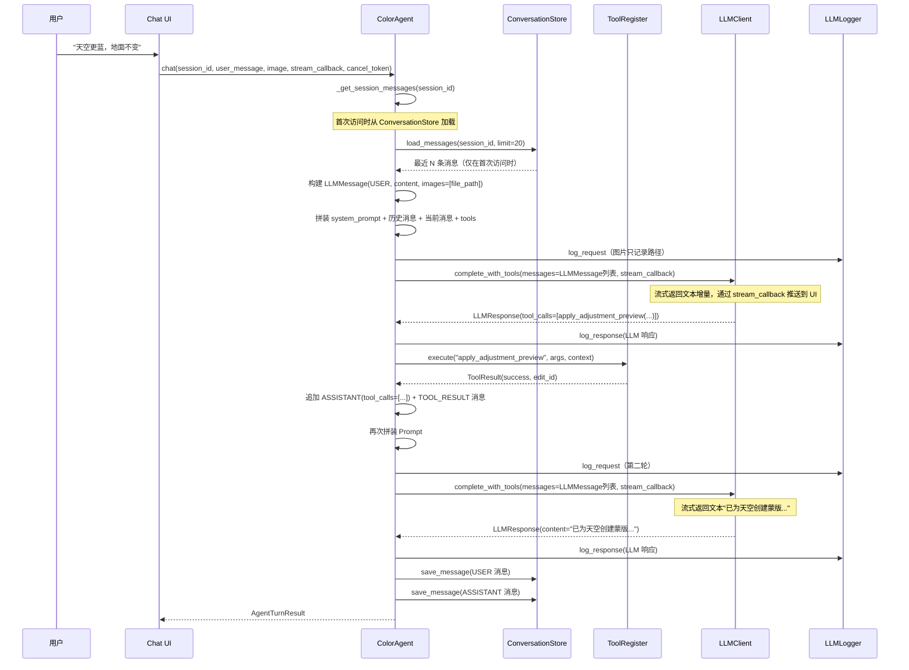
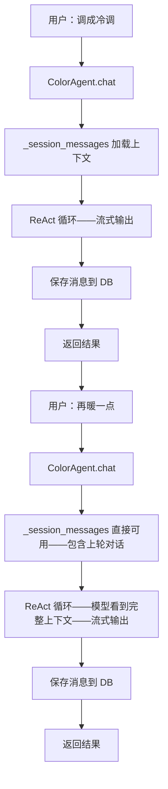
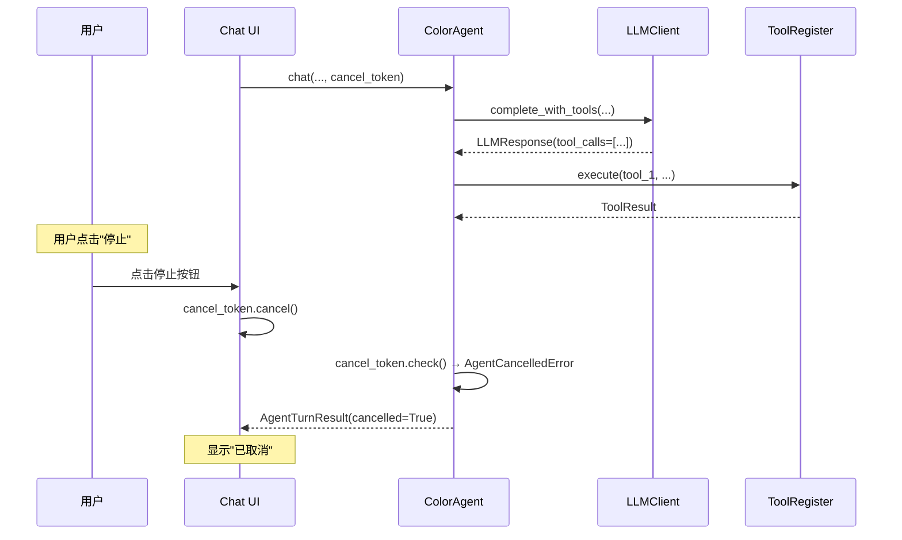
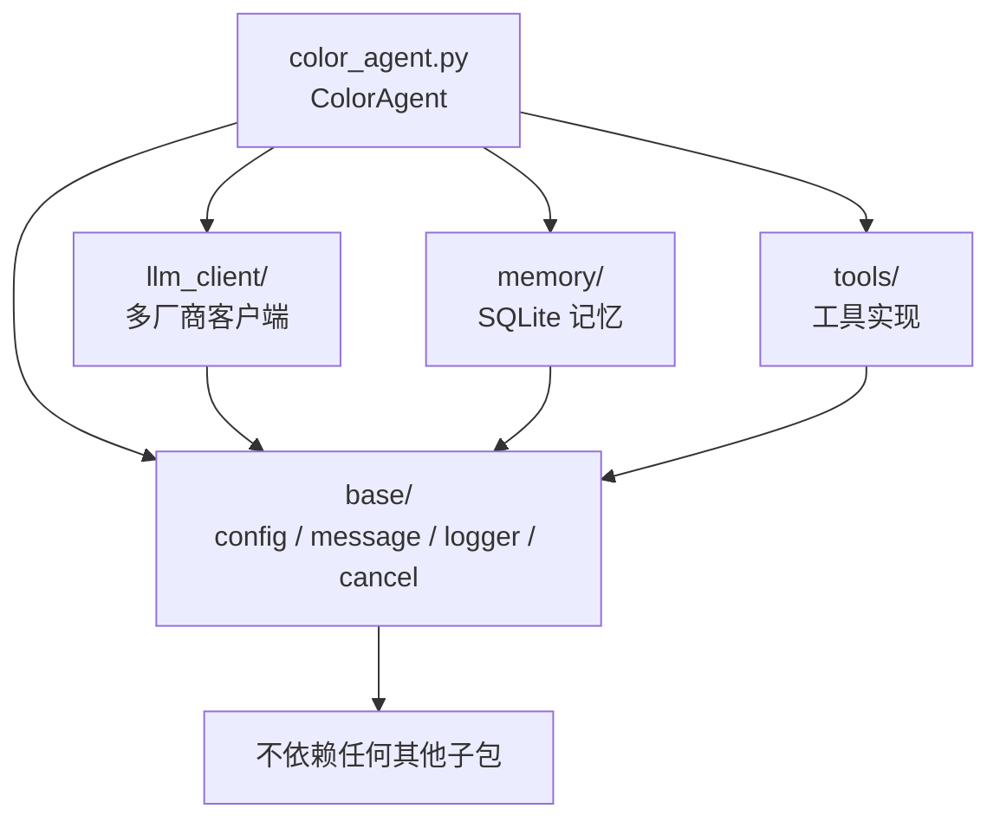

# TempusLoom 调色 Agent 技术方案 v2

**日期**: 2026-05-24
**状态**: 设计方案（修订版）
**基于**: 2026-05-19 v1 方案，根据实际代码结构和约束重新设计

---

## 1. 设计原则与约束

本方案遵循以下硬性约束：

1. **在现有 `src/tempusloom/agent/` 目录上改造**，不创建新的顶层 `agent_runtime` 目录。
2. **核心流程为 `ColorAgent`**，在其中实现 ReAct（Reasoning + Acting）循环。
3. **新建 `LLMMessage` 类**，统一存放每次对话内容，支持文本、图片、附件等多模态。`ASSISTANT` 角色的单条消息可携带多个 `tool_calls`。
4. **新建 `ToolRegister` 类**，用于注册和管理 Tool，最基础的 Tool 为 bash 命令执行。
5. **System Prompt 保存在 `ColorAgent` 中**，不外置。
6. **所有对话内容保存到数据库**（用户问题和模型回答），作为记忆。Tool 描述、Skill 描述、MCP 配置不存入数据库。
7. **每次提交给 LLM 的完整 Prompt 都输出到 `llm.log`**，保留两周，用于问题排查。日志中图片只记录文件路径，不记录完整 base64。
8. **多轮对话默认流式响应**，通过 `stream_callback` 将文本增量实时推送给 UI。
9. **支持取消机制**，通过 `CancelToken` 在 ReAct 循环的每次迭代和工具执行中检查取消信号。

---

## 2. 现有代码基线

当前 `src/tempusloom/agent/` 已有四个文件：

| 文件 | 内容 |
| --- | --- |
| `color_agent.py` | `TempusLoomColorAgent`，单轮调色，拼装 prompt → 调用 LLM → 解析 JSON |
| `clients.py` | `BaseLLMClient`、`OpenAICompatibleClient`、`AnthropicClient`，底层 HTTP 请求 |
| `config.py` | `AgentModelConfig`，provider / API key / model 配置与持久化 |
| `prompts.py` | `COLOR_GRADING_SYSTEM_PROMPT`，调色 JSON schema 和规则 |

现有 UI 在 `editor_window.py` 中已有不完整的多轮调用代码（`ColorAgentRuntime`、`AgentRuntimeWorker` 等），本期将删除这些不完整的代码，重新基于 `ColorAgent` 实现。

本方案在此基础上重新组织包结构，将平铺文件拆分为职责清晰的子包，同时保留所有现有接口。

---

## 3. 改造后的目录结构

```text
src/tempusloom/agent/
├── __init__.py                      # 包导出
├── color_agent.py                   # ★ 核心改造：ColorAgent 实现 ReAct 循环
│
├── base/                            # ★ Agent 通用基础设置与基础类
│   ├── __init__.py
│   ├── config.py                    # AgentModelConfig，从原 config.py 迁入
│   ├── prompts.py                   # COLOR_GRADING_SYSTEM_PROMPT，从原 prompts.py 迁入
│   ├── llm_message.py               # LLMMessage / MessageRole / ImageContent / Attachment
│   ├── llm_logger.py                # LLMLogger，Prompt 日志记录
│   └── cancel.py                    # CancelToken / AgentCancelledError，取消机制
│
├── llm_client/                      # ★ LLM 客户端包，支持多厂商
│   ├── __init__.py                  # create_llm_client() 工厂函数
│   ├── base.py                      # BaseLLMClient 抽象基类、LLMResponse、ToolCallInfo
│   ├── openai_compatible.py         # OpenAI 兼容接口（含 DeepSeek、Kimi、GLM 等）
│   ├── anthropic_client.py          # Claude / Anthropic 原生接口
│   ├── google_client.py             # Gemini 接口（本期只创建空文件）
│   └── codex_client.py              # OpenAI Codex / o 系列推理模型接口（本期只创建空文件）
│
├── memory/                          # ★ 记忆包
│   ├── __init__.py
│   ├── conversation_store.py        # 对话持久化存储（SQLite 会话与消息）
│   ├── long_term_memory.py          # 长期记忆（本期只创建空文件）
│   └── schema.py                    # 数据库建表、SQL 常量
│
├── skill/                           # ★ Skill 技能包（本期只创建空文件）
│   ├── __init__.py
│   ├── skill_registry.py            # SkillRegistry，技能注册与检索
│   ├── skill_manifest.py            # SkillManifest，技能声明
│   └── builtin/
│       └── __init__.py
│
├── mcp/                             # ★ MCP 协议包（本期只创建空文件）
│   ├── __init__.py
│   ├── client_manager.py            # MCP Client Manager
│   ├── tool_adapter.py              # MCP tools 适配
│   └── config.py                    # MCP Server 配置
│
└── tools/                           # ★ 工具注册与具体 Tool 实现
    ├── __init__.py
    ├── tool_register.py             # ToolRegister / ToolSpec / ToolResult / ToolContext
    ├── bash_tool.py                 # bash 命令执行 Tool（白名单模式）
    ├── native_color_tools.py        # TempusLoom 原生调色 Tool
    └── image_analysis_tools.py      # 图像分析 Tool
```

**标注说明：**
- ★ 标记的子包在本期完整实现。
- 标注"本期只创建空文件"的模块，只创建文件和基本类/函数签名，内部不实现任何逻辑。
- `skill/` 和 `mcp/` 包只在目录结构和文件层面存在，`ColorAgent` 不引用它们。

**包职责说明：**

| 子包 | 职责 | 本期状态 |
| --- | --- | --- |
| `base/` | 通用基础设施：配置、消息、日志、取消令牌 | 完整实现 |
| `llm_client/` | 多厂商 LLM 客户端（OpenAI 兼容 + Anthropic 完整实现，其余空文件） | 部分实现 |
| `memory/` | 对话持久化 + 长期记忆 | ConversationStore 完整实现，LongTermMemory 空文件 |
| `skill/` | Skill 技能系统 | 空文件 |
| `mcp/` | MCP 协议 | 空文件 |
| `tools/` | 工具注册与具体工具实现 | 完整实现 |

不创建 `agent_runtime`、`subagents` 等独立顶层目录。所有内容都在 `agent/` 包内。

---

## 4. 核心模块设计

### 4.1 ColorAgent — ReAct 核心

`ColorAgent` 替代现有 `TempusLoomColorAgent` 成为新的核心入口。它实现 ReAct 循环：

```
用户输入 → 拼装 System Prompt + 历史消息 + Tool 列表
         → 流式发送给 LLM
         → LLM 返回文本回答 或 Tool Call
         → 如果是 Tool Call → 执行 Tool → 将结果追加到消息 → 再次发送给 LLM
         → 循环直到 LLM 不再调用 Tool，返回最终回答
```

**核心接口：**

```python
class ColorAgent:
    """TempusLoom 调色 Agent，基于 ReAct 循环。"""

    def __init__(self, config: AgentModelConfig) -> None:
        self.config = config
        self.client = create_llm_client(config)
        self.system_prompt = self._build_system_prompt()
        self.tool_register = ToolRegister()
        self.conversation_store = ConversationStore()
        self.llm_logger = LLMLogger()
        self._session_messages: dict[str, list[LLMMessage]] = {}  # 短期记忆：session_id → 消息列表
        self._register_default_tools()

    def chat(
        self,
        session_id: str,
        user_message: str,
        image: dict | None = None,
        *,
        stream_callback: Callable[[str], None] | None = None,
        cancel_token: CancelToken | None = None,
    ) -> AgentTurnResult:
        """处理一轮用户消息，返回最终结果。

        参数：
        - session_id: 会话 ID（每张图片对应一个）
        - user_message: 用户输入文本
        - image: 图片信息 dict（file_path、mime_type 等），可选
        - stream_callback: 流式文本回调，每收到一个文本增量片段就调用一次
        - cancel_token: 取消令牌，用于中断 ReAct 循环

        短期记忆直接在内存中管理：self._session_messages[session_id] 存放当前会话的全部消息。
        每次调用 chat() 时：
        1. 从内存列表获取当前会话的消息历史
        2. 追加用户消息
        3. 进入 ReAct 循环（支持流式输出和取消）
        4. 循环结束后将用户消息和模型回答持久化到 ConversationStore
        """
        ...

    def cancel(self, session_id: str) -> None:
        """取消指定会话正在进行的 chat 请求。"""
        ...

    def _get_session_messages(self, session_id: str) -> list[LLMMessage]:
        """获取当前会话的消息列表。如果内存中没有则从数据库加载历史。"""
        if session_id not in self._session_messages:
            history = self.conversation_store.load_messages(session_id, limit=self.config.session_message_limit)
            self._session_messages[session_id] = history
        return self._session_messages[session_id]

    def _react_loop(
        self,
        messages: list[LLMMessage],
        *,
        stream_callback: Callable[[str], None] | None = None,
        cancel_token: CancelToken | None = None,
    ) -> LLMMessage:
        """ReAct 循环：调用 LLM → 解析响应 → 执行 Tool → 循环。"""
        ...

    def _build_system_prompt(self) -> str:
        """构建 System Prompt。"""
        ...

    def _register_default_tools(self) -> None:
        """注册默认工具（bash、调色、分析等）。"""
        ...
```

**System Prompt 设计：**

System Prompt 由以下部分拼接，保存在 `ColorAgent` 内部：

1. **角色定义**：你是 TempusLoom 调色助手，可以通过工具完成真实调色操作。
2. **调色 JSON Schema**：从 `base/prompts.py` 的 `COLOR_GRADING_SYSTEM_PROMPT` 提取 JSON 格式说明。
3. **可用工具说明**：动态列出 `ToolRegister` 中已注册工具的名称和用途。
4. **行为规则**：参数克制、保护肤色、局部调整用蒙版等（从现有 prompt 规则提取）。
5. **ReAct 指令**：告诉模型在需要操作时调用 Tool，需要思考时直接回答。

**ReAct 循环详细流程：**

```
1. 检查 cancel_token 是否已取消，如已取消则立即返回
2. 从 _session_messages[session_id] 获取当前会话的消息列表（内存中）
   - 如果内存中没有，从 ConversationStore 加载最近 N 条历史
3. 构建新 LLMMessage(USER, content + image_path)，追加到消息列表
4. 通过 llm_logger 记录 Prompt 到日志（图片只记录路径）
5. 调用 LLM client（传入 messages: list[LLMMessage]，流式接收）
6. 解析 LLM 响应：
   a) 如果包含 tool_calls →
      - 构建一条 ASSISTANT 消息（携带全部 tool_calls）
      - 对每个 tool_call 执行对应工具
      - 每个 tool_result 构建一条 TOOL_RESULT 消息
      - 回到步骤 1（再次检查取消 + 调用 LLM）
   b) 如果是纯文本回答 → 结束循环
7. 将用户消息和模型回答都保存到 ConversationStore（数据库持久化）
8. 消息已存在于内存列表中，下次 chat() 时直接可用
9. 返回 AgentTurnResult
```

**最大循环次数限制**：默认 20 次，通过 `AgentModelConfig.max_react_iterations` 配置，防止无限循环。

**向后兼容：**

保留 `TempusLoomColorAgent` 类不删除。其内部改为调用 `complete_with_tools()`（单轮调用封装），对外接口不变。`ColorAgent` 是新的多轮入口，UI 全部迁移到 `ColorAgent`。

### 4.2 base 包 — 通用基础

`base` 包存放 Agent 的通用基础设施，不依赖具体业务逻辑。所有子包和 `ColorAgent` 都依赖 `base`，但 `base` 不反向依赖其他子包。

#### 4.2.1 LLMMessage — 对话消息类

`LLMMessage` 是系统中所有对话内容的基础单元。每条消息都对应一个角色和内容。

**关键设计变更**：
- 移除 `TOOL_CALL` 角色。`ASSISTANT` 消息可直接携带多个 `tool_calls`。
- 各厂商客户端直接从 `LLMMessage` 转为各自的 API 格式，不经过中间 OpenAI 格式。`LLMMessage` 不提供 `to_api_dict()` 方法。
- 图片通过 `file_path` 引用，不存储 base64 数据。

```python
class MessageRole(Enum):
    SYSTEM = "system"
    USER = "user"
    ASSISTANT = "assistant"         # 可携带 content 和/或 tool_calls
    TOOL_RESULT = "tool_result"     # 工具执行的返回结果

class LLMMessage:
    """一条对话消息。"""

    role: MessageRole                      # 消息角色
    content: str                           # 文本内容
    images: list[ImageContent]             # 附带的图片（通过路径引用）
    attachments: list[Attachment]          # 其他附件（JSON 参数等）
    tool_calls: list[ToolCallInfo] | None  # ASSISTANT 时的工具调用列表（可多条）
    tool_call_id: str | None               # TOOL_RESULT 时对应的 tool call ID
    tool_name: str | None                  # TOOL_RESULT 时对应的工具名
    created_at: datetime                   # 创建时间
    metadata: dict                         # 扩展字段

    def to_dict(self) -> dict:
        """序列化为 JSON 字典，用于数据库存储。"""
        ...

    @classmethod
    def from_dict(cls, data: dict) -> LLMMessage:
        """从 JSON 字典反序列化。"""
        ...

class ImageContent:
    """消息中的图片。"""
    file_path: str               # 图片文件路径（发送给模型时从路径读取 base64）
    mime_type: str               # image/jpeg, image/png 等
    detail: str = "low"          # 发送给模型时的 detail 级别

class Attachment:
    """消息中的附件。"""
    type: str                    # attachment 类型标识（json、file 等）
    data: Any                    # 附件内容
    name: str | None             # 附件名称
```

**序列化规则：**

`LLMMessage` 支持两种序列化方向：

- **到数据库格式**：`to_dict()` / `from_dict()` 方法将消息序列化为 JSON 可存入 SQLite。图片字段存储文件路径字符串，不存储 base64。
- **到 API 格式**：由各厂商 `BaseLLMClient` 子类自行实现，直接从 `LLMMessage` 转换为各自 API 的消息格式。不在 `LLMMessage` 上定义序列化方法。

各 role 的 API 映射由客户端负责：
- `USER` → 各厂商的 user message 格式（图片从 `file_path` 读取 base64 后嵌入）
- `ASSISTANT`（有 tool_calls）→ 各厂商的 assistant + tool_calls 格式
- `ASSISTANT`（无 tool_calls）→ 各厂商的 assistant text 格式
- `TOOL_RESULT` → 各厂商的 tool result 格式

#### 4.2.2 LLMLogger — Prompt 日志

每次提交给 LLM 的完整 Prompt（包括 system prompt、所有消息、tool 列表）都要记录到日志文件。

**日志文件：**

```text
~/.tempusloom/agent/llm.log
```

**日志格式：**

```
========== 2026-05-24 14:30:00.123 ==========
Session: session-abc123
Turn: 3

--- System Prompt ---
[完整 system prompt 文本]

--- Messages ---
[1] role: user
    content: 天空更蓝，地面不变
    images: [D:/Photos/test.jpg]

[2] role: assistant
    content: 已应用冷调...

[3] role: user
    content: 再暖一点

--- Tools Available ---
- execute_bash
- apply_adjustment_preview
- create_mask_layer
...

--- Request Payload ---
[完整发送给 API 的 JSON]

--- Response ---
[LLM 返回的完整响应]

========== END ==========
```

**核心接口：**

```python
class LLMLogger:
    """LLM Prompt 日志记录器。"""

    def __init__(self, log_dir: Path | None = None, retention_days: int = 14) -> None:
        ...

    def log_request(
        self,
        session_id: str,
        turn: int,
        system_prompt: str,
        messages: list[LLMMessage],
        tools: list[dict],
        raw_payload: dict,
    ) -> None:
        """记录一次完整的 LLM 请求。

        图片内容只记录 file_path，不记录 base64 数据。
        raw_payload 中如果包含 base64 图片数据，日志中替换为路径摘要。
        """
        ...

    def log_response(self, session_id: str, response: Any) -> None:
        """记录 LLM 响应。"""
        ...

    def cleanup_old_logs(self) -> None:
        """清理超过保留期限的日志。"""
        ...
```

**日志中图片处理规则：**
- Messages 中的图片只记录 `file_path`，不记录 base64 数据。
- `raw_payload`（发送给 API 的完整 JSON）中如果包含 base64 图片数据，日志中替换为 `"<image: {file_path}, {size_kb}KB>"` 摘要。
- 这样日志文件不会因为图片数据而膨胀。

**保留策略：**
- 默认保留 14 天（两周）。
- 每次 `ColorAgent` 启动时检查并清理过期日志。
- 日志按天滚动，文件名 `llm_2026-05-24.log`。

#### 4.2.3 config.py — 配置

从原 `config.py` 迁入，`AgentModelConfig` 新增以下字段：

```python
@dataclass
class AgentModelConfig:
    # --- 原有字段保持不变 ---
    provider: str = "openai-compatible"
    base_url: str = ...
    api_key: str = ""
    model: str = ...
    temperature: float = 0.2
    max_tokens: int = 1400
    timeout_seconds: int = 90

    # --- 新增字段 ---
    max_react_iterations: int = 20       # ReAct 循环最大迭代次数
    session_message_limit: int = 20      # 短期记忆加载的最近消息条数
```

新增 `PROVIDER_PRESETS` 条目以覆盖新厂商。

现有 presets：

| Provider ID | 标签 |
| --- | --- |
| `openai-compatible` | OpenAI / 兼容接口 |
| `anthropic` | Claude / Anthropic |
| `deepseek` | DeepSeek |
| `kimi` | Kimi / Moonshot |
| `glm` | GLM / 智谱 |

新增 presets：

| Provider ID | 标签 | 客户端类 |
| --- | --- | --- |
| `gemini` | Gemini / Google | `GoogleClient`（本期空文件） |
| `codex` | Codex / OpenAI o-series | `CodexClient`（本期空文件） |

#### 4.2.4 prompts.py — 通用 Prompt

从原 `prompts.py` 迁入，保留 `COLOR_GRADING_SYSTEM_PROMPT`。新 `ColorAgent` 的 system prompt 从中提取调色 JSON schema 部分，组合为 ReAct 适用的完整指令。

#### 4.2.5 CancelToken — 取消令牌

取消机制允许用户在 Agent 处理过程中中断请求。通过 `CancelToken` 在 ReAct 循环的每次迭代和工具执行中检查取消信号。

**使用场景：**

1. **用户点击"停止"按钮**：用户在 Chat UI 中看到 Agent 正在处理，想要中止。UI 调用 `cancel_token.cancel()`，ReAct 循环在当前迭代结束后立即停止，已执行的调色操作保留，返回 `AgentTurnResult(cancelled=True)`。
2. **用户切换图片**：用户在 Agent 工作时切换到另一张图片。UI 取消当前请求，避免对旧图片继续操作。
3. **Agent 响应过慢**：用户不想等了，手动取消。

**设计方案：**

```python
# base/cancel.py

class AgentCancelledError(Exception):
    """Agent 操作被用户取消时抛出。"""
    pass

class CancelToken:
    """取消令牌，用于中断 ReAct 循环和工具执行。

    线程安全：cancel() 可从 UI 线程调用，check() 在 Agent 工作线程中调用。
    """

    def __init__(self) -> None:
        self._event = threading.Event()

    def cancel(self) -> None:
        """请求取消。由 UI 线程调用。"""
        self._event.set()

    @property
    def is_cancelled(self) -> bool:
        """是否已被取消。"""
        return self._event.is_set()

    def check(self) -> None:
        """检查取消状态。如果已取消则抛出 AgentCancelledError。

        在 ReAct 循环的每次迭代开始和工具执行前调用。
        """
        if self._event.is_set():
            raise AgentCancelledError("操作已被用户取消")

    def reset(self) -> None:
        """重置取消状态，用于复用 CancelToken。"""
        self._event.clear()
```

**集成点：**

| 位置 | 检查方式 | 取消后行为 |
| --- | --- | --- |
| `_react_loop()` 每次迭代开始 | `cancel_token.check()` | 抛出 `AgentCancelledError`，被 `chat()` 捕获 |
| `ToolContext` 携带 `cancel_token` | 工具自行检查 | bash 工具终止子进程，其他工具提前返回 |
| `LLMClient` 流式读取 | 每个 chunk 后检查 `cancel_token` | 停止读取流，抛出 `AgentCancelledError` |

**取消后的状态保证：**
- 已执行的 tool 操作保留在图片上（用户可通过撤销手动回退）。
- 已产生的消息保留在 `_session_messages` 中（不持久化到数据库）。
- `AgentTurnResult.cancelled = True`，UI 可据此展示"已取消"状态。

### 4.3 llm_client 包 — 多厂商 LLM 客户端

`llm_client` 包的核心目标是：**上层业务只面向 `BaseLLMClient` 抽象接口编程，切换厂商时只需修改配置中的 `provider` 字段，不需要改动任何业务代码。**

设计原则：
- `BaseLLMClient` 定义统一的输入输出契约，所有厂商客户端实现这个契约。
- 上层（`ColorAgent`）只通过 `create_llm_client(config)` 获得客户端实例，只调用 `BaseLLMClient` 上的方法。
- **各厂商客户端直接从 `LLMMessage` 转为各自的 API 格式**，不经过中间格式（如 OpenAI 格式）。
- 每个厂商的 API 格式差异（消息结构、认证方式、tool calling 格式等）封装在各自的客户端类内部，不暴露给上层。
- 新增厂商只需新建一个文件、继承 `BaseLLMClient`、在 `create_llm_client()` 中注册即可。

将原 `clients.py` 中的 `BaseLLMClient` 和各厂商实现拆分为独立文件，每个厂商一个客户端类。

**废弃 `complete()` 旧接口。** 所有客户端只需实现 `complete_with_tools()`。旧 `TempusLoomColorAgent` 内部改为调用 `complete_with_tools()` 进行单轮封装。

#### 4.3.1 包结构

```text
llm_client/
├── __init__.py              # create_llm_client() 工厂函数，导出公共类
├── base.py                  # BaseLLMClient、LLMResponse、ToolCallInfo、LLMClientError
├── openai_compatible.py     # OpenAICompatibleClient
├── anthropic_client.py      # AnthropicClient
├── google_client.py         # GoogleClient（本期空文件）
└── codex_client.py          # CodexClient（本期空文件）
```

#### 4.3.2 base.py — 抽象基类与公共数据类

`BaseLLMClient` 是整个 `llm_client` 包的核心契约。上层业务（`ColorAgent`）只依赖这个抽象类，不依赖任何具体厂商实现。

**关键设计：直接接受 LLMMessage，客户端自行转换格式**

- **输入统一为 `LLMMessage`**：所有客户端接受 `list[LLMMessage]` 作为消息输入，内部自行转换为各自厂商的 API 格式。不需要中间的 OpenAI 格式。
- **输出统一**：所有客户端返回相同的 `LLMResponse` 数据类，上层不需要关心底层厂商的差异。
- **流式支持**：通过 `stream_callback` 参数接收文本增量。
- **取消支持**：通过 `cancel_token` 参数支持中断流式读取。
- **切换厂商**：只需修改 `config.provider`，`create_llm_client()` 自动创建对应客户端，上层代码零改动。

```python
class LLMClientError(RuntimeError):
    pass

@dataclass
class ToolCallInfo:
    id: str                  # tool call ID
    name: str                # 工具名称
    arguments: str           # 参数 JSON 字符串

@dataclass
class LLMResponse:
    content: str | None              # 文本回答
    tool_calls: list[ToolCallInfo] | None  # 工具调用列表
    raw_response: dict               # 原始 API 响应

# 流式回调类型：接收文本增量片段
StreamCallback = Callable[[str], None]

class BaseLLMClient(ABC):
    """LLM 客户端抽象基类。

    上层业务只通过这个接口与 LLM 交互。
    所有厂商客户端必须实现 complete_with_tools()。
    切换厂商时上层代码不需要任何改动。
    """

    def __init__(self, config: AgentModelConfig) -> None:
        self.config = config

    @abstractmethod
    def complete_with_tools(
        self,
        *,
        system_prompt: str,
        messages: list[LLMMessage],
        tools: list[dict],
        stream_callback: StreamCallback | None = None,
        cancel_token: CancelToken | None = None,
    ) -> LLMResponse:
        """支持 tool calling 和流式响应的对话接口。

        参数：
        - system_prompt: 系统提示词
        - messages: LLMMessage 列表，各客户端内部自行转换为本厂商 API 格式
        - tools: OpenAI function calling 格式的工具列表（由 ToolRegister.to_openai_tools() 生成）
        - stream_callback: 流式文本回调，每收到一个文本增量就调用一次
        - cancel_token: 取消令牌，用于中断流式读取

        各厂商客户端内部负责：
        - 将 LLMMessage 列表转换为自身 API 的消息格式
        - 从 ImageContent.file_path 读取图片数据并转为自身 API 的图片格式
        - 将 OpenAI 格式 tools 转换为自身 API 的工具格式（如需要）
        - 将自身 API 响应转换回统一的 LLMResponse
        - 如果提供了 stream_callback，使用流式 API 并将文本增量传递给回调
        - 如果提供了 cancel_token，在流式读取的每个 chunk 后检查取消状态

        返回统一的 LLMResponse，上层无需关心厂商差异。
        """
        ...

    def _post_json(self, url: str, headers: dict, payload: dict) -> dict:
        """公共 HTTP POST 方法，从原 clients.py 迁入。"""
        ...

    def _post_stream(
        self,
        url: str,
        headers: dict,
        payload: dict,
        cancel_token: CancelToken | None = None,
    ) -> Iterator[dict]:
        """公共 HTTP 流式 POST 方法。

        逐行读取 SSE 流，每个 chunk 解析为 dict 后 yield。
        如果 cancel_token 被设置，立即停止读取。
        """
        ...
```

**上层调用示例（ColorAgent 中）：**

```python
# ColorAgent 中获取客户端（不关心具体厂商）
self.client = create_llm_client(config)

# 调用统一接口（不关心底层是 OpenAI 还是 Anthropic）
response = self.client.complete_with_tools(
    system_prompt=self.system_prompt,
    messages=messages,           # 直接传 LLMMessage 列表
    tools=tools,
    stream_callback=stream_callback,  # 文本增量实时推送
    cancel_token=cancel_token,        # 支持取消
)

# 处理统一输出
if response.tool_calls:
    for tc in response.tool_calls:
        # tc.name、tc.arguments 格式统一，不依赖具体厂商
        ...
elif response.content:
    # 文本回答格式统一
    ...
```

#### 4.3.3 openai_compatible.py — OpenAI 兼容客户端

覆盖所有兼容 OpenAI Chat Completions API 的厂商：

| 厂商 | Provider ID | base_url |
| --- | --- | --- |
| OpenAI | `openai-compatible` | `https://api.openai.com/v1` |
| DeepSeek | `deepseek` | `https://api.deepseek.com/v1` |
| Kimi / Moonshot | `kimi` | `https://api.moonshot.cn/v1` |
| GLM / 智谱 | `glm` | `https://open.bigmodel.cn/api/paas/v4` |

这些厂商共享同一个 `OpenAICompatibleClient` 实现，区别仅在于 `base_url` 和 `model`。

```python
class OpenAICompatibleClient(BaseLLMClient):

    def _serialize_messages(self, messages: list[LLMMessage]) -> list[dict]:
        """将 LLMMessage 列表转换为 OpenAI API 格式。

        内部处理：
        - USER: content 为 text + image_url（从 file_path 读取 base64）
        - ASSISTANT: content 为文本，或 tool_calls 数组
        - TOOL_RESULT: role="tool", tool_call_id, content
        """
        ...

    def _serialize_tools(self, tools: list[dict]) -> list[dict]:
        """工具格式无需转换（已经是 OpenAI 格式）。"""
        return tools

    def complete_with_tools(
        self,
        *,
        system_prompt: str,
        messages: list[LLMMessage],
        tools: list[dict],
        stream_callback: StreamCallback | None = None,
        cancel_token: CancelToken | None = None,
    ) -> LLMResponse:
        """OpenAI function calling 格式。

        请求体：
        {
            "model": "...",
            "messages": [{"role": "system", ...}, ...],
            "tools": [{"type": "function", "function": {...}}],
            "stream": true/false,
            "temperature": ...,
            "max_tokens": ...
        }

        流式模式下逐 chunk 解析：
        - content delta → 传递给 stream_callback
        - tool_calls delta → 累积，最终合并为完整 tool_calls

        响应解析：
        - response["choices"][0]["message"]["content"] → LLMResponse.content
        - response["choices"][0]["message"]["tool_calls"] → LLMResponse.tool_calls
        """
        ...
```

#### 4.3.4 anthropic_client.py — Anthropic 客户端

```python
class AnthropicClient(BaseLLMClient):

    def _serialize_messages(self, messages: list[LLMMessage]) -> list[dict]:
        """将 LLMMessage 列表转换为 Anthropic API 格式。

        差异处理：
        - system prompt 不在 messages 里，由 complete_with_tools 提取到顶层
        - 图片用 {"type": "image", "source": {"type": "base64", "media_type": ..., "data": ...}}
          （从 ImageContent.file_path 读取 base64）
        - ASSISTANT 有 tool_calls 时转为 content_blocks 格式
        - TOOL_RESULT 转为 role="user" + tool_result content block
        """
        ...

    def _serialize_tools(self, tools: list[dict]) -> list[dict]:
        """将 OpenAI 格式 tools 转为 Anthropic 格式。

        OpenAI: {"type": "function", "function": {"name": ..., "parameters": ...}}
        Anthropic: {"name": ..., "description": ..., "input_schema": ...}
        """
        ...

    def complete_with_tools(
        self,
        *,
        system_prompt: str,
        messages: list[LLMMessage],
        tools: list[dict],
        stream_callback: StreamCallback | None = None,
        cancel_token: CancelToken | None = None,
    ) -> LLMResponse:
        """Anthropic tool use 格式。

        请求体：
        {
            "model": "...",
            "system": "...",
            "messages": [...],
            "tools": [...],
            "stream": true/false,
            "temperature": ...,
            "max_tokens": ...
        }
        """
        ...
```

#### 4.3.5 google_client.py — Gemini 客户端（本期空文件）

```python
class GoogleClient(BaseLLMClient):
    """Google Gemini API 客户端。本期只创建空文件，不实现。"""

    def complete_with_tools(self, *, system_prompt, messages, tools,
                            stream_callback=None, cancel_token=None) -> LLMResponse:
        raise NotImplementedError("Gemini 客户端将在后续版本实现")
```

#### 4.3.6 codex_client.py — Codex / o 系列客户端（本期空文件）

```python
class CodexClient(BaseLLMClient):
    """OpenAI Codex / o 系列推理模型客户端。本期只创建空文件，不实现。"""

    def complete_with_tools(self, *, system_prompt, messages, tools,
                            stream_callback=None, cancel_token=None) -> LLMResponse:
        raise NotImplementedError("Codex 客户端将在后续版本实现")
```

#### 4.3.7 __init__.py — 工厂函数（厂商切换的唯一入口）

`create_llm_client()` 是厂商切换的唯一入口。修改 `config.provider` 即可切换厂商，上层代码无需任何改动。

```python
from .base import BaseLLMClient, LLMResponse, ToolCallInfo, LLMClientError, StreamCallback
from .openai_compatible import OpenAICompatibleClient
from .anthropic_client import AnthropicClient
from .google_client import GoogleClient
from .codex_client import CodexClient

def create_llm_client(config: AgentModelConfig) -> BaseLLMClient:
    """根据 config.provider 创建对应 LLM 客户端。

    这是厂商切换的唯一入口：
    - 修改 config.provider → 自动切换到对应厂商客户端
    - 返回类型始终是 BaseLLMClient → 上层代码不依赖具体厂商
    - 新增厂商只需：1) 新建文件实现 BaseLLMClient，2) 在此注册
    """
    clients = {
        "anthropic": AnthropicClient,
        "gemini": GoogleClient,
        "codex": CodexClient,
    }
    cls = clients.get(config.provider, OpenAICompatibleClient)
    return cls(config)
```

所有未显式列出的 provider（`openai-compatible`、`deepseek`、`kimi`、`glm` 等）都走 `OpenAICompatibleClient`。

**新增厂商的步骤：**

1. 在 `llm_client/` 下新建一个文件（如 `new_provider.py`）。
2. 继承 `BaseLLMClient`，实现 `complete_with_tools()`（含 `_serialize_messages()` 和 `_serialize_tools()`）。
3. 在 `create_llm_client()` 的 `clients` 字典中注册。
4. 在 `base/config.py` 的 `PROVIDER_PRESETS` 中添加默认配置。
5. 上层代码（`ColorAgent`）不需要任何改动。

### 4.4 memory 包 — 记忆系统

memory 包包含两个层次，职责明确分离：

1. **对话持久化**：将所有对话内容（用户问题和模型回答）保存到 SQLite 数据库，作为完整的历史记录。
2. **长期记忆**：跨会话的用户偏好、风格资产和学习结果（本期只创建空文件，不实现）。

**短期记忆**不单独成类，直接在 `ColorAgent` 中用一个 `dict[str, list[LLMMessage]]` 管理。`ColorAgent._session_messages` 以 `session_id` 为 key 存放每个会话的消息列表，每次 `chat()` 时直接从内存读取，无需经过额外抽象层。首次访问时从 `ConversationStore` 加载历史。

Tool 描述、Skill 描述、MCP 配置不存入数据库。

#### 4.4.1 包结构

```text
memory/
├── __init__.py
├── conversation_store.py    # 对话持久化存储（SQLite 会话与消息）
├── long_term_memory.py      # 长期记忆（本期只创建空文件）
└── schema.py                # 数据库建表、SQL 常量
```

#### 4.4.2 数据库表设计

```sql
-- 会话表
CREATE TABLE sessions (
    id          TEXT PRIMARY KEY,
    image_id    TEXT NOT NULL,
    image_name  TEXT,
    created_at  TEXT NOT NULL,
    updated_at  TEXT NOT NULL
);

-- 消息表：存放所有对话内容（持久化）
CREATE TABLE messages (
    id          INTEGER PRIMARY KEY AUTOINCREMENT,
    session_id  TEXT NOT NULL REFERENCES sessions(id),
    role        TEXT NOT NULL,          -- user / assistant / tool_result
    content     TEXT NOT NULL,          -- 文本内容
    images      TEXT,                   -- JSON 数组，存放图片文件路径
    attachments TEXT,                   -- JSON 数组，存放附件信息
    tool_calls  TEXT,                   -- JSON 数组，ASSISTANT 时的工具调用（可多条）
    tool_call_id TEXT,                  -- tool_result 时的对应 ID
    tool_name   TEXT,                   -- tool_result 时的对应工具名
    metadata    TEXT,                   -- JSON，存放 token 数、耗时等
    created_at  TEXT NOT NULL
);

-- 长期偏好表（本期预留，不实现读写逻辑）
CREATE TABLE preferences (
    id          INTEGER PRIMARY KEY AUTOINCREMENT,
    key         TEXT NOT NULL UNIQUE,
    value_json  TEXT NOT NULL,
    confidence  REAL DEFAULT 0.0,
    source      TEXT DEFAULT '',
    created_at  TEXT NOT NULL,
    updated_at  TEXT NOT NULL
);

-- 风格事件表（本期预留，不实现读写逻辑）
CREATE TABLE style_events (
    id              INTEGER PRIMARY KEY AUTOINCREMENT,
    image_fingerprint TEXT,
    user_prompt     TEXT,
    result_summary  TEXT,
    feedback        TEXT,
    created_at      TEXT NOT NULL
);

-- 索引
CREATE INDEX idx_messages_session ON messages(session_id, created_at);
CREATE INDEX idx_preferences_key ON preferences(key);
```

**注意**：`messages` 表中 `tool_calls` 字段替代了原来的 `tool_name` + `tool_call_id` + `tool_arguments` 三个字段。ASSISTANT 消息的多个 tool_calls 存储为一个 JSON 数组。TOOL_RESULT 消息仍使用 `tool_call_id` 和 `tool_name` 字段关联。

#### 4.4.3 ConversationStore — 对话持久化

负责将所有对话内容保存到 SQLite，并提供按会话加载消息的能力。

```python
class ConversationStore:
    """对话持久化存储，基于 SQLite。"""

    def __init__(self, db_path: Path | None = None) -> None:
        ...

    def create_session(self, image_id: str, image_name: str) -> str:
        """创建新会话，返回 session_id。"""
        ...

    def get_session(self, session_id: str) -> dict | None:
        """获取会话信息。"""
        ...

    def get_or_create_session(self, image_id: str, image_name: str) -> str:
        """获取已有会话或创建新会话。"""
        ...

    def save_message(self, session_id: str, message: LLMMessage) -> None:
        """保存一条消息到数据库。"""
        ...

    def load_messages(self, session_id: str, limit: int = 50) -> list[LLMMessage]:
        """加载会话的全部历史消息。"""
        ...

    def delete_session(self, session_id: str) -> None:
        """删除会话及其所有消息。"""
        ...

    def close(self) -> None:
        """关闭数据库连接。"""
        ...
```

#### 4.4.4 短期记忆 — 在 ColorAgent 中直接管理

短期记忆不单独成类，直接在 `ColorAgent` 中通过一个字典管理：

```python
# ColorAgent 内部
self._session_messages: dict[str, list[LLMMessage]] = {}
```

**工作机制：**

- `chat()` 被调用时，通过 `_get_session_messages(session_id)` 获取该会话的消息列表。
- 如果内存中已有该 session 的列表，直接返回（追加新消息）。
- 如果内存中没有（首次访问或 Agent 重启），从 `ConversationStore` 加载最近 N 条历史消息（N 由 `config.session_message_limit` 控制，默认 20）。
- ReAct 循环中的所有消息（用户输入、assistant+tool_calls、tool_result、模型回答）都追加到这个列表中。
- 循环结束后，将用户消息和模型回答持久化到 `ConversationStore`。
- 内存中的列表在下次 `chat()` 时直接可用，无需再次查询数据库。

**图片存储：**

消息中的图片存储文件路径，不存储 base64 数据：

```python
# 数据库中 images 字段存储格式
[{"file_path": "D:/Photos/sunset.jpg", "mime_type": "image/jpeg", "detail": "low"}]
```

发送给 LLM 时，由各厂商客户端从 `file_path` 读取 base64 数据并嵌入 API 请求。

#### 4.4.5 LongTermMemory — 长期记忆（本期空文件）

长期记忆本期只创建空文件，不实现任何逻辑。

```python
# memory/long_term_memory.py
class LongTermMemory:
    """长期记忆：跨会话用户偏好。本期只创建空文件。"""

    def __init__(self, db_path: Path | None = None) -> None:
        raise NotImplementedError("长期记忆将在后续版本实现")
```

#### 4.4.6 不存入数据库的内容

以下内容通过代码和配置文件管理，不存入数据库：
- Tool 描述和 Schema（代码中定义）
- Skill 描述和配置（文件中定义）
- MCP Server 配置（JSON 配置文件）
- System Prompt（代码中定义）

### 4.5 skill 包 — 技能系统（本期空文件）

Skill 是可复用的调色知识或处理流程。本期只创建目录和空文件，不实现任何逻辑。

```text
skill/
├── __init__.py
├── skill_registry.py      # 空文件
├── skill_manifest.py      # 空文件
└── builtin/
    └── __init__.py         # 空文件
```

后续版本实现时将包含：
- `SkillManifest`：技能声明数据类（id、触发词、类型、instructions 等）
- `SkillRegistry`：技能注册表（加载、匹配、上下文注入）
- `builtin/`：内置调色技能（如"日系通透"、"电影感"等）

### 4.6 mcp 包 — MCP 协议支持（本期空文件）

MCP（Model Context Protocol）本期只创建目录和空文件，不实现任何逻辑。

```text
mcp/
├── __init__.py
├── client_manager.py      # 空文件
├── tool_adapter.py        # 空文件
└── config.py              # 空文件
```

后续版本实现时将包含：
- `MCPClientManager`：管理多个外部 MCP Server 连接
- `MCPToolAdapter`：将 MCP tool schema 转换为 TempusLoom ToolSpec
- MCP 配置文件：`~/.tempusloom/config/mcp_servers.json`

### 4.7 tools 包 — 工具注册与具体工具实现

#### 4.7.1 ToolRegister — 工具注册与管理

`ToolRegister` 负责管理所有可用工具的声明、执行和错误处理。位于 `tools/tool_register.py`。

```python
class ToolSpec:
    """工具声明。"""
    name: str                      # 工具名称
    description: str               # 工具描述（供模型理解）
    input_schema: dict             # 参数 JSON Schema
    handler: Callable[[dict, ToolContext], ToolResult]  # 执行函数

class ToolResult:
    """工具执行结果。"""
    success: bool
    data: Any                      # 返回数据
    error: str | None              # 错误信息
    edit_id: str | None            # 如果修改了图片，记录 edit ID
    requires_confirmation: bool = False  # 是否需要用户确认（用于 bash 工具）

class ToolContext:
    """工具执行上下文，由 ColorAgent 注入。"""
    session_id: str
    image_id: str | None
    apply_payload: Callable | None  # 应用调色参数的回调
    cancel_token: CancelToken | None  # 取消令牌
    project_dir: str | None        # 当前项目目录（用于 bash 工具白名单）

class ToolRegister:
    """工具注册表。"""

    def register(self, spec: ToolSpec) -> None:
        """注册一个工具。"""
        ...

    def execute(self, name: str, arguments: dict, context: ToolContext) -> ToolResult:
        """执行指定工具。"""
        ...

    def get_tool_list(self) -> list[ToolSpec]:
        """返回所有已注册工具列表。"""
        ...

    def to_openai_tools(self) -> list[dict]:
        """序列化为 OpenAI function calling 格式，供 LLM 调用。

        各厂商客户端从 ToolRegister 获取此格式后，
        如需转换为自身格式（如 Anthropic），在客户端内部完成。
        """
        ...
```

#### 4.7.2 工具清单

| 工具名 | 文件 | 作用 | 是否修改图片 |
| --- | --- | --- | --- |
| `execute_bash` | `bash_tool.py` | 执行 bash 命令（白名单模式） | 否 |
| `get_current_image_context` | `native_color_tools.py` | 获取当前图片名、尺寸、编辑状态 | 否 |
| `apply_adjustment_preview` | `native_color_tools.py` | 临时预览调色参数 | 是，临时 |
| `commit_adjustment` | `native_color_tools.py` | 提交全局调色 | 是 |
| `create_mask_layer` | `native_color_tools.py` | 创建蒙版调色图层 | 是 |
| `create_adjustment_layer` | `native_color_tools.py` | 创建调整图层 | 是 |
| `undo_last_agent_edit` | `native_color_tools.py` | 撤销最近 Agent 编辑 | 是 |
| `analyze_histogram` | `image_analysis_tools.py` | 分析图片直方图 | 否 |
| `extract_dominant_colors` | `image_analysis_tools.py` | 提取主色 | 否 |

#### 4.7.3 bash 工具设计 — 白名单模式

`execute_bash` 使用白名单模式控制命令执行权限：

```python
# bash_tool.py
ToolSpec(
    name="execute_bash",
    description="在本地执行 bash 命令并返回输出。可用于文件操作、调用外部脚本等。",
    input_schema={
        "type": "object",
        "properties": {
            "command": {"type": "string", "description": "要执行的 bash 命令"},
        },
        "required": ["command"],
    },
    handler=_bash_handler,
)
```

**白名单策略：**

```python
class BashWhitelistPolicy:
    """bash 命令白名单策略。"""

    def __init__(self, allowed_dirs: list[str]) -> None:
        self.allowed_dirs = [Path(d).resolve() for d in allowed_dirs]

    def check(self, command: str) -> BashCheckResult:
        """检查命令是否在白名单范围内。

        返回：
        - allowed=True: 命令安全，可直接执行
        - allowed=False, reason="...": 命令超出白名单，需要用户确认
        """
        # 解析命令中涉及的文件路径
        # 如果所有路径都在 allowed_dirs 下 → allowed=True
        # 否则 → allowed=False，附上原因说明
        ...
```

**执行策略：**

1. **默认安全范围**：`ToolContext.project_dir`（当前项目/图片所在文件夹）。命令操作此目录内的文件时自动放行。
2. **超出白名单**：命令涉及白名单外的路径或危险操作时，`ToolResult.requires_confirmation = True`，`ToolResult.data` 包含待确认的命令内容。
3. **用户确认流程**：`ColorAgent` 的 ReAct 循环检测到 `requires_confirmation` 时，将命令通过 `AgentTurnResult` 返回给 UI，等待用户确认后再次执行。
4. **执行限制**：使用 `subprocess.run()` 执行，设置 timeout（默认 30 秒），支持 `CancelToken` 中断。
5. **工作目录**：默认为 `ToolContext.project_dir`。

**确认流程伪代码：**

```python
# ReAct 循环中
result = self.tool_register.execute(tc.name, args, context)

if result.requires_confirmation:
    # 不直接执行，返回给 UI 等待用户确认
    pending_command = result.data["command"]
    # 将确认请求记录为 TOOL_RESULT 消息
    # 模型看到"需要用户确认"后，等待下一轮对话
    ...
```

**工具注册时机：**

`ColorAgent.__init__()` 中调用 `_register_default_tools()`，将所有内置工具注册到 `ToolRegister`。MCP 工具在后续版本中通过 `MCPClientManager.connect_all()` 后注册进来。

---

## 5. 数据流

### 5.1 单轮普通调色（ReAct 流程）



### 5.2 AgentTurnResult 结构

```python
@dataclass
class AgentTurnResult:
    success: bool                           # 是否成功
    message: str                            # 最终回答文本
    tool_calls: list[ToolCallRecord]        # 本轮所有 tool 调用记录
    edit_ids: list[str]                     # 修改了图片的 edit ID
    errors: list[str]                       # 错误列表
    cancelled: bool = False                 # 是否被用户取消
    pending_confirmation: dict | None = None  # 等待用户确认的操作（bash 白名单外命令）
```

### 5.3 多轮对话



### 5.4 取消流程



---

## 6. 与现有代码的集成

### 6.1 文件迁移映射

| 原文件 | 迁移到 | 处理方式 |
| --- | --- | --- |
| `clients.py` | `llm_client/` 包（拆分为多个文件） | 原文件保留为薄代理，import 转发到新位置 |
| `config.py` | `base/config.py` | 原文件保留为薄代理 |
| `prompts.py` | `base/prompts.py` | 原文件保留为薄代理 |

原文件保留为薄代理（re-export），确保外部 `from tempusloom.agent.config import ...` 等现有导入不受影响。

### 6.2 向后兼容策略

```python
# 原 clients.py 保留为薄代理：
# tempusloom/agent/clients.py
from .llm_client import BaseLLMClient, OpenAICompatibleClient, AnthropicClient, LLMClientError, create_llm_client  # noqa
```

```python
# 原 config.py 保留为薄代理：
# tempusloom/agent/config.py
from .base.config import AgentModelConfig, PROVIDER_PRESETS, load_agent_config, save_agent_config, CONFIG_PATH  # noqa
```

```python
# 原 prompts.py 保留为薄代理：
# tempusloom/agent/prompts.py
from .base.prompts import COLOR_GRADING_SYSTEM_PROMPT  # noqa
```

### 6.3 UI 集成改造

**删除现有不完整的多轮代码**：`editor_window.py` 中已有的 `ColorAgentRuntime`、`AgentRuntimeWorker` 等不完整的多轮调用代码将被删除，重新基于 `ColorAgent` 实现。

`editor_window.py` 中的调用方式从：

```python
# 旧：直接调用单轮 Agent（或不完整的多轮 Runtime）
agent = TempusLoomColorAgent(config)
result = agent.run_single_turn(context)
```

改为：

```python
# 新：通过 ColorAgent 多轮对话（流式 + 取消）
cancel_token = CancelToken()
result = color_agent.chat(
    session_id,
    user_message,
    image,
    stream_callback=self._on_agent_stream_text,
    cancel_token=cancel_token,
)
```

UI 需要：
1. 管理 `session_id`（每张图片对应一个 session）。
2. 展示多轮消息历史和 tool 调用摘要。
3. 流式展示模型回答文本。
4. 提供"停止"按钮，调用 `cancel_token.cancel()`。
5. 处理 bash 工具的用户确认流程。

### 6.4 __init__.py 导出

```python
# tempusloom/agent/__init__.py

# 旧接口（向后兼容）
from .color_agent import TempusLoomColorAgent, AgentRequestContext, AgentRunResult  # noqa
from .base.config import AgentModelConfig, PROVIDER_PRESETS, load_agent_config, save_agent_config  # noqa
from .llm_client import create_llm_client, LLMClientError  # noqa

# 新接口
from .color_agent import ColorAgent, AgentTurnResult  # noqa
from .base.llm_message import LLMMessage, MessageRole, ImageContent, Attachment  # noqa
from .base.cancel import CancelToken, AgentCancelledError  # noqa
from .tools.tool_register import ToolRegister, ToolSpec, ToolResult, ToolContext  # noqa
from .base.llm_logger import LLMLogger  # noqa
from .memory.conversation_store import ConversationStore  # noqa
```

---

## 7. ReAct 循环详细设计

### 7.1 循环伪代码

```python
def _react_loop(
    self,
    messages: list[LLMMessage],
    *,
    stream_callback: StreamCallback | None = None,
    cancel_token: CancelToken | None = None,
) -> LLMMessage:
    """ReAct 循环。"""
    max_iterations = self.config.max_react_iterations  # 默认 20

    for i in range(max_iterations):
        # 0. 检查取消
        if cancel_token:
            cancel_token.check()

        # 1. 获取工具列表（本地工具 + MCP 工具）
        tools = self.tool_register.to_openai_tools()

        # 2. 记录日志（图片只记录路径）
        self.llm_logger.log_request(
            session_id, turn=i,
            system_prompt=self.system_prompt,
            messages=messages,
            tools=tools,
            raw_payload={},  # 由各客户端自行记录
        )

        # 3. 调用 LLM（直接传 LLMMessage 列表，流式 + 取消）
        response = self.client.complete_with_tools(
            system_prompt=self.system_prompt,
            messages=messages,
            tools=tools,
            stream_callback=stream_callback,
            cancel_token=cancel_token,
        )

        # 4. 记录响应日志
        self.llm_logger.log_response(session_id, response)

        # 5. 判断是否有 tool_calls
        if response.tool_calls:
            # 一条 ASSISTANT 消息携带全部 tool_calls
            tool_call_msg = LLMMessage(
                role=MessageRole.ASSISTANT,
                content=response.content or "",
                tool_calls=response.tool_calls,  # 多个 tool_calls 存在一条消息中
            )
            messages.append(tool_call_msg)

            # 执行每个 tool，每个结果一条 TOOL_RESULT 消息
            for tc in response.tool_calls:
                if cancel_token:
                    cancel_token.check()

                result = self.tool_register.execute(
                    tc.name,
                    json.loads(tc.arguments),
                    self._build_tool_context(cancel_token=cancel_token),
                )

                # bash 工具白名单外命令需要用户确认
                if result.requires_confirmation:
                    result_msg = LLMMessage(
                        role=MessageRole.TOOL_RESULT,
                        content=f"命令需要用户确认：{result.data['command']}",
                        tool_call_id=tc.id,
                        tool_name=tc.name,
                    )
                    messages.append(result_msg)
                    continue  # 跳过实际执行，等待模型生成新方案

                result_msg = LLMMessage(
                    role=MessageRole.TOOL_RESULT,
                    content=json.dumps(result.data) if result.success else result.error,
                    tool_call_id=tc.id,
                    tool_name=tc.name,
                )
                messages.append(result_msg)

            # 继续循环，让模型看到 tool 结果
            continue

        else:
            # 纯文本回答，结束循环
            assistant_msg = LLMMessage(
                role=MessageRole.ASSISTANT,
                content=response.content,
            )
            messages.append(assistant_msg)
            return assistant_msg

    # 超过最大迭代次数
    return LLMMessage(
        role=MessageRole.ASSISTANT,
        content="处理步骤过多，请简化需求或分步操作。",
    )
```

### 7.2 System Prompt 结构

`ColorAgent._build_system_prompt()` 返回的 System Prompt 由以下部分组成：

```
[1. 角色与能力定义]
你是 TempusLoom 调色助手。你可以通过调用工具来完成真实的调色操作。
你需要先分析用户需求和图片，然后决定是否需要调用工具。

[2. 调色 JSON Schema]
（从 base/prompts.py 的 COLOR_GRADING_SYSTEM_PROMPT 中提取 adjust / layers / mask 格式说明）

[3. 行为规则]
- 参数克制、专业、可逆
- 人像保护肤色
- 局部调整使用蒙版
- 图层顺序即渲染顺序

[4. 工具使用指引]
当需要修改图片时，调用对应工具。不要在文本回答中直接输出调色 JSON。
先思考（Reasoning），再行动（Acting）。

[5. 当前会话上下文]
图片信息、当前编辑状态（由 chat() 方法动态注入）
```

---

## 8. 包间依赖关系



规则：
- `base` 不依赖其他子包，是纯基础层。
- `llm_client` 只依赖 `base.config`、`base.llm_message`、`base.cancel`。
- `memory` 只依赖 `base.llm_message`。
- `tools` 只依赖 `base.cancel`（`ToolContext` 使用 `CancelToken`）。
- `color_agent.py` 是唯一依赖所有子包的入口。
- `skill/` 和 `mcp/` 本期不参与依赖关系。

---

## 9. 错误处理

### 9.1 LLM 错误

| 场景 | 处理方式 |
| --- | --- |
| API 网络错误 | 返回错误信息给用户，支持重试 |
| 返回格式异常（无 content 无 tool_calls） | 记录日志，提示用户"模型返回异常" |
| tool_calls 参数 JSON 解析失败 | 要求模型修正一次（将错误信息作为 tool_result 返回） |
| 超过最大 ReAct 迭代次数 | 停止循环，返回提示信息 |
| 不支持的厂商 provider | `create_llm_client()` 回退到 `OpenAICompatibleClient` |
| 流式读取中断 | 如果是取消导致则正常处理，否则重试一次 |

### 9.2 Tool 错误

| 场景 | 处理方式 |
| --- | --- |
| 工具不存在 | 返回 tool_result 告知模型"工具不存在" |
| 参数校验失败 | 返回具体校验错误 |
| 工具执行异常 | 捕获异常，返回错误信息，不中断循环 |
| bash 命令超时 | 返回"命令执行超时" |
| bash 命令白名单外 | 返回 `requires_confirmation=True`，等待用户确认 |

### 9.3 数据库错误

| 场景 | 处理方式 |
| --- | --- |
| 写入失败 | 不阻断调色流程，记录到文件日志 |
| 读取失败 | 使用空历史继续，提示用户 |

### 9.4 日志错误

日志写入失败不应影响任何业务流程。LLMLogger 内部捕获所有 IO 异常。

### 9.5 取消错误

| 场景 | 处理方式 |
| --- | --- |
| 用户主动取消 | `chat()` 捕获 `AgentCancelledError`，返回 `AgentTurnResult(cancelled=True)` |
| 取消时工具正在执行 | 工具通过 `cancel_token` 检测并提前退出，bash 工具终止子进程 |
| 取消时 LLM 正在流式返回 | 客户端停止读取流，抛出 `AgentCancelledError` |

---

## 10. 测试方案

### 10.1 单元测试

| 测试对象 | 测试内容 |
| --- | --- |
| `LLMMessage` | to_dict/from_dict 序列化、多 tool_calls 存储、图片路径存储 |
| `CancelToken` | cancel/check/is_cancelled、线程安全性 |
| `ToolRegister` | 注册/执行/错误处理/to_openai_tools 格式 |
| `ConversationStore` | 会话创建、消息保存/加载（含多 tool_calls）、删除 |
| `LLMLogger` | 日志写入、图片路径记录（不含 base64）、清理过期日志 |
| `BashWhitelistPolicy` | 白名单内命令放行、白名单外命令拦截 |
| `bash_tool` | 正常执行、超时、白名单外命令返回 requires_confirmation |
| `OpenAICompatibleClient` | LLMMessage 序列化为 OpenAI 格式、流式响应解析、tool_calls 解析 |
| `AnthropicClient` | LLMMessage 序列化为 Anthropic 格式、tool use 解析、流式响应 |

### 10.2 集成测试

| 测试场景 | 验证点 |
| --- | --- |
| 单轮"天空更蓝" | 模型调用 create_mask_layer → 返回蒙版 → 流式输出最终文本 |
| 多轮"再暖一点" | 第二轮包含第一轮历史，模型基于上下文继续修改 |
| 多 tool_calls | 模型一次返回 2 个 tool_call → 一条 ASSISTANT 消息携带 → 两个 TOOL_RESULT |
| Tool 错误恢复 | 模型调用不存在工具 → 收到错误 → 模型修正 |
| 消息持久化 | chat 后 ConversationStore 数据库有 USER + ASSISTANT 消息 |
| 短期记忆连续性 | 第二轮 chat 时 _session_messages 包含上轮消息，无需再查数据库 |
| 日志记录 | chat 后 llm.log 有完整记录，图片只记录路径 |
| 取消流程 | chat 执行中 cancel → 返回 cancelled=True，已执行操作保留 |
| bash 白名单 | 白名单内命令直接执行，白名单外返回 requires_confirmation |
| 流式输出 | stream_callback 被多次调用，最终结果与完整文本一致 |

### 10.3 向后兼容测试

| 测试场景 | 验证点 |
| --- | --- |
| `from tempusloom.agent.clients import ...` | 旧导入路径仍可用 |
| `from tempusloom.agent.config import ...` | 旧导入路径仍可用 |
| `TempusLoomColorAgent.run_single_turn()` | 现有测试全部通过（内部改用 complete_with_tools） |
| JSON payload 解析 | layers 不被错误包装成 adjust |
| 图层渲染顺序 | 数组顺序即渲染顺序 |

---

## 11. 实施路线图

### Phase 1: 基础包重构

目标：将现有平铺文件迁移到子包结构，建立 `base`、`llm_client` 两个核心包。

任务：

1. 创建 `base/` 包，迁入 `config.py`、`prompts.py`，新建 `llm_message.py`、`llm_logger.py`、`cancel.py`。
2. 创建 `llm_client/` 包，将 `clients.py` 拆分为 `base.py`、`openai_compatible.py`、`anthropic_client.py`。`google_client.py` 和 `codex_client.py` 只创建空文件。
3. 保留原文件为薄代理（re-export），确保旧导入路径可用。
4. 更新 `__init__.py` 导出。
5. 编写单元测试。
6. 运行现有测试确保向后兼容。

验收：

- 旧导入 `from tempusloom.agent.clients import ...` 仍可用。
- `create_llm_client()` 可创建 OpenAI 和 Anthropic 客户端。
- `CancelToken` 可正常使用。
- 现有单轮测试全部通过。

### Phase 2: Memory + LLMLogger + ToolRegister

目标：建立记忆、日志和工具注册基础设施。

任务：

1. 创建 `memory/` 包，实现 `ConversationStore`（SQLite 对话持久化）。`long_term_memory.py` 只创建空文件。
2. 实现 `LLMLogger`（`base/llm_logger.py`，日志记录、图片只记路径、清理）。
3. 创建 `tools/` 包，实现 `tool_register.py`（ToolRegister、ToolSpec、ToolResult、ToolContext）。
4. 实现 `bash_tool`（`tools/bash_tool.py`，白名单模式）。
5. 创建 `skill/` 和 `mcp/` 包的目录结构和空文件。
6. 编写单元测试。

验收：

- `ConversationStore` 可创建会话、保存/加载消息（含多 tool_calls）。
- `LLMLogger` 可写入日志（图片只记录路径）并清理过期日志。
- `ToolRegister` 可注册/执行工具，`to_openai_tools()` 输出正确格式。
- bash 工具白名单内命令直接执行，白名单外返回 requires_confirmation。

### Phase 3: ColorAgent ReAct 核心

目标：在 `ColorAgent` 中实现完整的 ReAct 循环（含流式和取消）。

任务：

1. 改造 `color_agent.py`，新增 `ColorAgent` 类。
2. 实现 `_build_system_prompt()`，整合调色 JSON schema 和工具说明。
3. 实现 `_react_loop()`，含多 tool_calls 处理、流式输出、取消检查。
4. 实现 `chat()` 方法，整合 memory 加载、ReAct 循环（stream_callback + cancel_token）、结果保存。
5. 注册默认工具（bash + 原生调色工具）。
6. 保留 `TempusLoomColorAgent`（内部改用 `complete_with_tools`）。
7. 编写 ReAct 循环的集成测试（mock LLM 返回，含多 tool_calls、取消场景）。

验收：

- 用户可连续说"调成冷调""再亮一点""撤销刚才的修改"。
- 每轮对话消息保存到数据库。
- 每次完整 Prompt 记录到 llm.log（图片只记录路径）。
- 流式输出在 UI 中实时显示。
- 取消操作正确返回 cancelled=True。
- 现有单轮测试仍通过。

### Phase 4: 原生调色工具

目标：注册 TempusLoom 特有的调色工具。

任务：

1. 新建 `tools/native_color_tools.py`，实现调色相关工具。
2. 新建 `tools/image_analysis_tools.py`，实现图像分析工具。
3. 将工具注册到 `ColorAgent._register_default_tools()`。
4. 连接 UI 的 `apply_agent_json_payload` 回调。

验收：

- "天空更蓝，地面不变"正确创建线性渐变蒙版。
- "撤销刚才的修改"正确回退。
- 直方图分析工具返回有意义的结果。

### Phase 5: UI 集成

目标：将 UI 迁移到多轮 `ColorAgent`（流式 + 取消）。

任务：

1. **删除** `editor_window.py` 中已有的不完整多轮代码（`ColorAgentRuntime`、`AgentRuntimeWorker` 等）。
2. 修改 `editor_window.py`，使用 `ColorAgent.chat()` 替代旧调用。
3. 管理 session 生命周期（打开图片时创建，关闭时保留）。
4. 展示多轮消息历史和 tool 调用摘要。
5. 实现流式文本显示。
6. 实现"停止"按钮（`cancel_token.cancel()`）。
7. 实现 bash 工具的用户确认 UI。

验收：

- UI 可连续对话，消息历史正确展示。
- 模型回答文本实时流式显示。
- 点击"停止"可取消正在进行的请求，不留下不一致状态。
- 白名单外的 bash 命令弹出确认对话框。

---

## 12. 暂缓内容

以下内容不在第一版范围内，后续迭代考虑：

- MCP Server 模式（TempusLoom 暴露 MCP Server）。
- MCP Client 实现（连接外部 MCP Server）。
- Skill 技能系统实现。
- Google Gemini / Codex 客户端实现。
- 长期偏好自动学习和 LongTermMemory 实现。
- SubAgent 多候选生成。
- 可执行 Skill 沙盒。
- 多图片批处理。
- 消息摘要压缩策略。
- 内存中会话淘汰策略（留给自动压缩上下文机制）。
- Schema 迁移框架。
- Token 使用量统计和成本估算。
